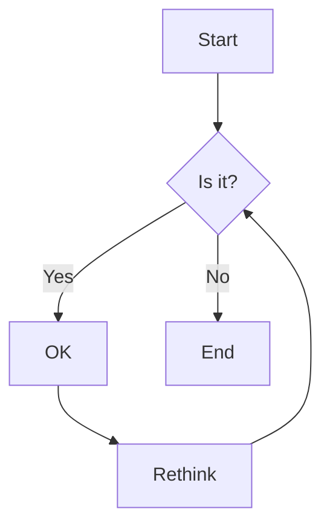

# QuestDB Documentation

Uses [Docusaurus](https://docusaurus.io/). 

## Quick start

First, clone & enter the repo directory:

```shell
git clone git@github.com:questdb/documentation.git
cd documentation
```

Next, install dependencies:

```script
yarn
```

```script
yarn start
```

This command starts a local development server and open up a browser window.

Most changes are reflected live without having to restart the server.

### Docker

```bash
docker-compose up
```

## Contributing 

You'll need to sign a quick CLA.

Pretty standard, [check it out](https://cla-assistant.io/questdb/documentation).

This is done on PR creation.

### Creating PRs

First create a new branch.

Locally, ensure your changes look good.

Then push your branch to GitHub and create a PR.

We'll review the PR and generate a preview build.

A QuestDB member must add the `preview` label to your PR to deploy a preview build.

Once it looks good, we'll merge!

### Enhancements, bugs, typos 

We'd love your help!

Raise a [GH issue](https://github.com/questdb/documentation/issues/new/choose) or tackle a PR.

## Syntax

### Railroad diagrams

Our SQL syntax diagrams are created using Railroad.

To create a diagram, use the [Railroad online editor](https://www.bottlecaps.de/rr/ui) to see it rendered.

Once you're happy with it, copy the Railroad syntax and add it to:

```
static/images/docs/diagrams/.railroad
```

Ensure it fits the full pattern - there are many examples:

```text
renameTable
  ::= 'RENAME' 'TABLE' oldName 'TO' newName
```

Be sure to maintain proper indentation!

Next, run the `scripts/railroad.py [name]` script to generate the SVG image.

For example:

```shell
python3 scripts/railroad.py renameTable
```

During its final output, a markdown image with the appropriate syntax is printed:

```text
Copy the image syntax below and paste it into your markdown file:

```

Copy this syntax and paste it into the markdown file where you want the diagram to appear.

The script requires:

* Java (to run the `rr.war` file)
* Python (to execute the `railroad.py` script)

### Math Expressions

Use LaTeX-style math between `$` for inline or `$$` for block equations:

```
$$
text
Inline equation: $f(x) = x^2$
Block equation:
$$
\int_{-\infty}^{\infty} e^{-x^2} dx = \sqrt{\pi}
$$
```

### Mermaid Diagrams

Create diagrams using Mermaid syntax in code blocks:



### Syntax

Syntax highlighting for many languages, including QuestDB SQL:

```questdb-sql
questdb-sql
SELECT
FROM trades
WHERE timestamp > dateadd('d', -1, now())
SAMPLE BY 1h;
```

### Admonitions

Use special callouts for important information:

```
:::note
This is a note
:::

:::tip
This is a tip
:::

:::info
This is info
:::

:::warning
This is a warning
:::

:::danger
This is a danger warning
:::
```

### Components

Special React components available:

- `<RemoteRepoExample />`: Include code examples from other QuestDB repos
- `<TabItem />`: Create tabbed content sections
- `<Tabs />`: Container for tab items

See examples in the documentation source files.

## Linting

The coding style rules are defined by [Prettier](https://prettier.io/) and
enforced by [Eslint](https://eslint.org)

On top of this, we follow the rules set by the
[JavaScript Standard Style](https://standardjs.com/rules.html).

You do not need to run the linting task manually, Webpack will take care of that
for you.
