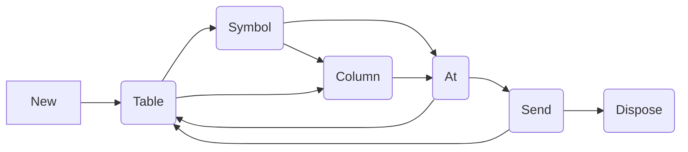
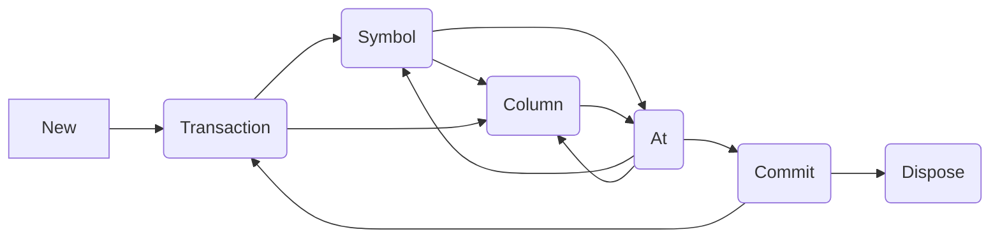

import { ILPClientsTable } from "@theme/ILPClientsTable"

QuestDB supports the .NET ecosystem with its dedicated .NET client, engineered
for high-throughput data ingestion, focusing on insert-only operations.

This quick start guide aims to familiarize you with the fundamental features of
the .NET client, including how to establish a connection, authenticate, and
perform basic insert operations.

<ILPClientsTable language=".NET" />

## Requirements

- .NET 6.0 or higher is required.
- QuestDB must be running. If not, see
  [the general quick start guide](/docs/quick-start/).

## Quickstart

The latest version of the library is
[2.0.0](https://www.nuget.org/packages/net-questdb-client/)
([changelog](https://github.com/questdb/net-questdb-client/releases/tag/v2.0.0))

The NuGet package can be installed using the dotnet CLI:

```shell
dotnet add package net-questdb-client
```

The .NET ILP client streams data to QuestDB using the ILP format.

The format is a text protocol with the following form:

`table,symbol=value column1=value1 column2=value2 nano_timestamp`

The client provides a convenient API to manage the construction and sending of
ILP rows.

:::note

`Sender` is single-threaded, and uses a single connection to the database.

If you want to send in parallel, you can use multiple senders and standard async
tasking.

:::

### Basic usage

```csharp
using var sender = Sender.New("http::addr=localhost:9000;");
await sender.Table("metric_name")
    .Symbol("Symbol", "value")
    .Column("number", 10)
    .Column("double", 12.23)
    .Column("string", "born to shine")
    .AtAsync(new DateTime(2021, 11, 25, 0, 46, 26));
await sender.SendAsync();
```

### Multi-line send (sync)

```csharp
using var sender = Sender.New("http::addr=localhost:9000;auto_flush=off;");
for(int i = 0; i < 100; i++)
{
    sender.Table("metric_name")
        .Column("counter", i)
        .At(DateTime.UtcNow);
}
sender.Send();
```

## Initialisation

Construct new Senders via the `Sender` factory.

It is mandatory to provide the `addr` config, as this defines the transport
protocol and the server location.

By default, the HTTP protocol uses `9000`, the same as the other HTTP endpoints.
Optionally, TCP uses `9009'.

### With a configuration string

It is recommended, where possible, to initialise the sender using a
[configuration string](https://questdb.io/docs/reference/api/ilp/overview/#configuration-strings).

Configuration strings provide a convenient shorthand for defining client
properties, and are validated during construction of the `Sender`.

```csharp
using var sender = Sender.New("http::addr=localhost:9000;");
```

If you want to initialise some properties programmatically after the initial
config string, you can use `Configure` and `Build`.

```csharp
(Sender.Configure("http::addr=localhost:9000;") with { auto_flush = AutoFlushType.off }).Build()
```

### From options

The sender API also supports construction from `SenderOptions`.

```csharp
await using var sender = Sender.New(new SenderOptions());
```

You might use this when binding options from configuration:

```json
{
  "QuestDB": {
    "addr": "localhost:9000",
    "tls_verify": "unsafe_off;"
  }
}
```

```csharp
var options = new ConfigurationBuilder()
    .AddJsonFile("config.json")
    .Build()
    .GetSection("QuestDB")
    .Get<SenderOptions>();
```

### Choosing a protocol

The client currently supports streaming ILP data over HTTP and TCP transports.

The sender performs some validation, but it is still possible that errors are
present and the server will reject the data.

With the TCP protocol, this will lead to a dropped connection and an error
server-side.

With the HTTP transport, errors will be returned via standard HTTP responses and
propagated to the user via `IngressError`.

HTTP transport also provides better guarantees around transactionality for
submitted data.

In general, it is recommended to use the HTTP transport. If the absolute highest
performance is required, then in some cases, the TCP transport will be faster.
However, it is important to use deduplication keys judiciously in your table
schemas, as this will help guard against duplication of data in the error case.

## Preparing Data

Senders use an internal buffer to convert input values into an ILP-compatible
UTF-8 byte-string.

This buffer can be controlled using the `init_buf_size` and `max_buf_size`
parameters.

Here is how to build a buffer of rows ready to be sent to QuestDB.

:::warning

The senders are **not** thread safe, since they manage an internal buffer. If
you wish to send data in parallel, you should construct multiple senders and use
non-blocking I/O to submit to QuestDB.

:::

The API follows the following overall flow:



### Specify the table

An ILP row starts with a table name, using `Table`.

```csharp
sender.Table("table_name");
```

The table name must always be called before other builder functions.

### Add symbols

A [symbol](/docs/concept/symbol/) is a dictionary-encoded string, used to
efficiently store commonly repeated data. This is frequently used for
identifiers, and symbol columns can have
[secondary indexes](/docs/concept/indexes/) defined upon them.

Symbols can be added using calls to `Symbol`, which expects a symbol column
name, and string value.

```csharp
sender.Symbol("foo", "bah");
```

All symbol columns must be defined before any other column definition.

### Add other columns

A number of data types can be submitted to QuestDB via ILP, including string /
long / double / DateTime / DateTimeOffset.

These can be written using the `Column` functions.

```csharp
sender.Column("baz", 102);
```

### Finish the row

A row is completed by defining the designated timestamp value:

```csharp
sender.At(DateTime.UtcNow);
```

Generation of the timestamp can be offloaded to the server, using `AtNow`.

:::caution

Using a server generated timestamp via AtNow/AtNowAsync is not compatible with
QuestDB's deduplication feature, and should be avoided where possible.

:::

#### Designated timestamp

QuestDB clusters the table around a
[designated timestamp](/docs/concept/designated-timestamp/).

The timestamp provided in the `At*` calls will be used as the designated
timestamp.

Choosing the right timestamp is critical for performance!

#### Table creation

If the table corresponding to the ILP submission does not exist, it will be
automatically created, with a 'best guess' schema. This may not be optimal for
your use case, but this functionality does provide flexibility in what the
database will accept.

It is recommended, when possible, to create your tables ahead of time using a
thought-out schema. This can be done via APIs other than the ILP ingestion.

## Flushing

Once the buffer is filled with data ready to be sent, it can be flushed to the
database automatically, or manually.

### Auto-flushing

When the `At` functions are called, the auto-flushing parameters are checked to
see if it is appropriate to flush the buffer. If an auto-flush is triggered,
data will be sent to QuestDB.

```csharp
sender.At(new DateTime(0,0,1));
```

To avoid blocking the calling thread, one can use the Async overloads of the
`At`. functions e.g `AtAsync`.

```csharp
await sender.AtNowAsync();
```

Auto-flushing can be enabled or disabled:

```csharp
using var sender = Sender.New("http::addr=localhost:9000;auto_flush=off;"); // or `on`, defaults to `on`
```

#### Flush by rows

Users can specify a threshold of rows to flush. This is effectively a submission
batch size by number of rows.

```csharp
using var sender = Sender.New("http::addr=localhost:9000;auto_flush=on;auto_flush_rows=5000;");
```

By default, HTTP senders will send after `75,000` rows, and TCP after `600`
rows.

:::tip

`auto_flush_rows` and `auto_flush_interval` are both enabled by default. If you
wish to only auto-flush based on one of these properties, you can disable the
other using `off` or `-1`.

:::

#### Flush by interval

Specify a time interval between batches. This is the elapsed time from the last
flush, and is checked when the `At` functions are called.

```csharp
using var sender = Sender.New("http::addr=localhost:9000;auto_flush=on;auto_flush_interval=5000;");
```

By default, `auto_flush_interval` is set to `1000` ms.

#### Flush by bytes

Specify a buffer length after which to flush, effectively a batch size in UTF-8
bytes. This should be set according to `init_buf_size` $\lt$ `auto_flush_bytes`
$\leq$ `max_buf_size`.

This can be useful if a user has variety in their row sizes and wants to limit
the request sizes.

```csharp
using var sender = Sender.New("http::addr=localhost:9000;auto_flush=on;auto_flush_bytes=65536;");
```

By default, this is disabled, but set to `100 KiB`.

### Explicit flushing

Manually flush the buffer using `Send`. and `SendAsync`. This will send any
outstanding data to the QuestDB server.

```csharp
using var sender = Sender.New("http::addr=localhost:9000;auto_flush=off;");
sender.Table("foo").Symbol("bah", "baz").Column("num", 123).At(DateTime.UtcNow);
await sender.SendAsync(); // send non-blocking
// OR
sender.Send(); // send synchronously
```

It is recommended to always end your submission code with a manual flush. This
will ensure that all data has been sent before disposing of the Sender.

## Transactions

The HTTP transport provides transactionality for requests. Each request in a
flush sends a batch of rows, which will be committed at once, or not at all.

Server-side transactions are only for a single table. Therefore, a request
containing multiple tables will be split into a single transaction per table. If
a transaction fails for one table, other transactions may still complete.

For true transactionality, one can use the transaction feature to enforce a
batch only for a single table.

Transactions follow this flow:



One way to use this route effectively is to assign a single `Sender` per table,
and then use transactions for each sender. This minimises server-side overhead
by reducing how many tables are submitted to from different connections.

It is still recommended to enable deduplication keys on your tables. This is
because an early request timeout, or failure to read the response stream, could
cause an error in the client, even though the server was returning a success
response. Therefore, making the table idempotent is best to allow for safe
retries. With TCP, this is a much greater risk.

### Opening a transaction

To start a `Transaction`, and pass the name of the table.

```csharp
sender.Transaction("foo");
```

The sender will return errors if you try to specify an alternate table whilst a
transaction is open.

### Adding data

Add data to a transaction in the usual way, but without calling `Table` between
rows.

```csharp
sender.Symbol("bah", "baz").Column("num", 123).At(DateTime.UtcNow); // adds a symbol, integer column, and ends with current timestamp
```

### Closing a transaction

Commit transactions and flush using `Commit` or `CommitAsync`. This will flush
data to the database, and remove the transactional state.

```csharp
await sender.CommitAsync();
```

Alternatively, if you wish to discard the transaction, you can use `Rollback`.
This will clear the buffer and transactional state, without sending data to the
server.

```csharp
sender.Rollback();
```

## Misc.

### Cancelling rows

Cancel the current line using `CancelRow`.

This must be called before the row is complete, as otherwise it may have been
sent already.

```csharp
sender.Table("foo").Symbol("bah", "baz").CancelRow(); // cancels the current row
sender.Table("foo").Symbol("bah", "baz").At(DateTime.UtcNow); // invalid - no row to cancel
```

This can be useful if a row is being built step-by-step, and an error is thrown.
The user can cancel the row and preserve the rest of the buffer that was built
correctly.

### Trimming the buffer

Set properties in the configuration string to control the buffer size.

It may be that the case that the buffer needs to grow earlier and shrink later.

In this scenario, the user can call `Truncate`. This will trim the internal
buffer, removing extra pages (each of which is the size of `init_buf_size`),
reducing overall memory consumption:

```csharp
using var sender = Sender.New("http::addr=localhost:9000;init_buf_size=1024;");
for (int i = 0; i < 100_000; i++) {
    sender.Table("foo").Column("num", i).At(DateTime.UtcNow);
}
await sender.SendAsync(); // buffer is now flushed and empty
sender.Truncate(); // buffer is trimmed back to `init_buf_size`
```

### Clearing the buffer

Keep the sender, but clear the internal buffer.

This can be performed using `Clear`.

```csharp
sender.Clear(); // empties the internal buffer
```

## Security

### TLS

Enable TLS via the `https` or `tcps` protocol, along with other associated
configuration.

TLS is supported only by [QuestDB Enterprise](/docs/operations/tls/) version of
QuestDB.

For development purposes, the verification of TLS certificates can be disabled:

```csharp
using var sender = Sender.New("https::addr=localhost:9000;tls_verify=unsafe_off;");
```

### Authentication

The client supports both TLS encryption, and authentication.

The authentication credentials can be set up by following the
[RBAC](https://questdb.io/docs/operations/rbac/) documentation.

#### HTTP

The HTTP protocol supports authentication via
[Basic Authentication](https://datatracker.ietf.org/doc/html/rfc7617), and
[Token Authentication](https://datatracker.ietf.org/doc/html/rfc6750).

**Basic Authentication**

Configure Basic Authentication with the `username` and `password` parameters:

```csharp
using var sender = Sender.New("http::addr=localhost:9000;username=admin;password=quest;");
```

**Token Authentication**

Configure Token Authentication with the `username` and `token` parameters:

```csharp
using var sender = Sender.New("http::addr=localhost:9000;username=admin;token=<token>");
```

#### TCP

TCP authentication can be configured using JWK tokens:

```csharp
using var sender = Sender.New("tcp::addr=localhost:9000;username=admin;token=<token>");
```

## Examples

### Basic Usage

```csharp
using System;
using QuestDB;

using var sender =  Sender.New("http::addr=localhost:9000;");
await sender.Table("trades")
    .Symbol("pair", "USDGBP")
    .Symbol("type", "buy")
    .Column("traded_price", 0.83)
    .Column("limit_price", 0.84)
    .Column("qty", 100)
    .Column("traded_ts", new DateTime(2022, 8, 6, 7, 35, 23, 189, DateTimeKind.Utc))
    .AtAsync(DateTime.UtcNow);
await sender.Table("trades")
    .Symbol("pair", "GBPJPY")
    .Column("traded_price", 135.97)
    .Column("qty", 400)
    .AtAsync(DateTime.UtcNow);
await sender.SendAsync();
```

### Streaming data

```csharp
using System.Diagnostics;
using QuestDB;

var rowsToSend = 1e6;

using var sender = Sender.New("http::addr=localhost:9000;auto_flush=on;auto_flush_rows=75000;auto_flush_interval=off;");

var timer = new Stopwatch();
timer.Start();

for (var i = 0; i < rowsToSend; i++)
{
    await sender.Table("trades")
        .Symbol("pair", "USDGBP")
        .Symbol("type", "buy")
        .Column("traded_price", 0.83)
        .Column("limit_price", 0.84)
        .Column("qty", 100)
        .Column("traded_ts", new DateTime(
            2022, 8, 6, 7, 35, 23, 189, DateTimeKind.Utc))
        .AtAsync(DateTime.UtcNow);
}

// Ensure no pending rows.
await sender.SendAsync();

timer.Stop();

Console.WriteLine(
    $"Wrote {rowsToSend} rows in {timer.Elapsed.TotalSeconds} seconds at a rate of {rowsToSend / timer.Elapsed.TotalSeconds} rows/second.");
```

### HTTP TLS with Basic Authentication

```csharp
using QuestDB;

// Runs against QuestDB Enterprise, demonstrating HTTPS and Basic Authentication support.

using var sender =
    Sender.New("https::addr=localhost:9000;tls_verify=unsafe_off;username=admin;password=quest;");
await sender.Table("trades")
    .Symbol("pair", "USDGBP")
    .Symbol("type", "buy")
    .Column("traded_price", 0.83)
    .Column("limit_price", 0.84)
    .Column("qty", 100)
    .Column("traded_ts", new DateTime(
        2022, 8, 6, 7, 35, 23, 189, DateTimeKind.Utc))
    .AtAsync(DateTime.UtcNow);
await sender.Table("trades")
    .Symbol("pair", "GBPJPY")
    .Column("traded_price", 135.97)
    .Column("qty", 400)
    .AtAsync(DateTime.UtcNow);
await sender.SendAsync();
```

### TCP TLS with JWK Authentication

```csharp
using System;
using QuestDB;

//    Demonstrates TCPS connection against QuestDB Enterprise

using var sender =
    Sender.New(
        "tcps::addr=localhost:9009;tls_verify=unsafe_off;username=admin;token=NgdiOWDoQNUP18WOnb1xkkEG5TzPYMda5SiUOvT1K0U=;");
// See: https://questdb.io/docs/reference/api/ilp/authenticate
await sender.Table("trades")
    .Symbol("pair", "USDGBP")
    .Symbol("type", "buy")
    .Column("traded_price", 0.83)
    .Column("limit_price", 0.84)
    .Column("qty", 100)
    .Column("traded_ts", new DateTime(
        2022, 8, 6, 7, 35, 23, 189, DateTimeKind.Utc))
    .AtAsync(DateTime.UtcNow);
await sender.Table("trades")
    .Symbol("pair", "GBPJPY")
    .Column("traded_price", 135.97)
    .Column("qty", 400)
    .AtAsync(DateTime.UtcNow);
await sender.SendAsync();
```

## Next Steps

Dive deeper into the .NET client capabilities by exploring more examples
provided in the
[GitHub repository](https://github.com/questdb/dotnet-questdb-client).

To learn _The Way_ of QuestDB SQL, see the
[Query & SQL Overview](/docs/reference/sql/overview/).

Should you encounter any issues or have questions, the
[Community Forum](https://community.questdb.io/) is a vibrant platform for
discussions.
