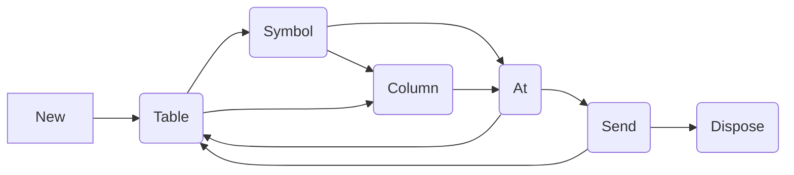
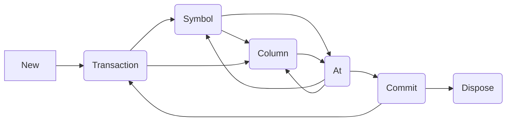

import { ILPClientsTable } from "@theme/ILPClientsTable"

QuestDB supports the .NET ecosystem with its dedicated .NET client, engineered
for high-throughput data ingestion, focusing on insert-only operations.

Apart from blazing fast ingestion, our clients provide these key benefits:

- **Automatic table creation**: No need to define your schema upfront.
- **Concurrent schema changes**: Seamlessly handle multiple data streams with
  on-the-fly schema modifications
- **Optimized batching**: Use strong defaults or curate the size of your batches
- **Health checks and feedback**: Ensure your system's integrity with built-in
  health monitoring
- **Automatic write retries**: Reuse connections and retry after interruptions

This quick start guide aims to familiarize you with the fundamental features of
the .NET client, including how to establish a connection, authenticate, and
perform basic insert operations.

<ILPClientsTable language=".NET" />

:::info

This page focuses on our high-performance ingestion client, which is optimized
for **writing** data to QuestDB. For retrieving data, we recommend using a
[PostgreSQL-compatible .NET library](/docs/pgwire/c-sharp/) or our
[HTTP query endpoint](/docs/reference/sql/overview/#rest-http-api).

:::

## Requirements

- .NET 6.0 or higher is required.
- QuestDB must be running. If not, see
  [the general quick start guide](/docs/quick-start/).

## Client installation

The latest version of the library is
[2.1.0](https://www.nuget.org/packages/net-questdb-client/)
([changelog](https://github.com/questdb/net-questdb-client/releases/tag/2.1.0))

The NuGet package can be installed using the dotnet CLI:

```shell
dotnet add package net-questdb-client
```

:::note

`Sender` is single-threaded, and uses a single connection to the database.

If you want to send in parallel, you can use multiple senders and standard async
tasks.

:::

## Authentication

### HTTP

The HTTP protocol supports authentication via
[Basic Authentication](https://datatracker.ietf.org/doc/html/rfc7617), and
[Token Authentication](https://datatracker.ietf.org/doc/html/rfc6750).

**Basic Authentication**

Configure Basic Authentication with the `username` and `password` parameters:

```csharp
using QuestDB;
 ...
using var sender = Sender.New("http::addr=localhost:9000;username=admin;password=quest;");
 ...
```

**Token Authentication**

_QuestDB Enterprise Only_

Configure Token Authentication with the `username` and `token` parameters:

```csharp
using var sender = Sender.New("http::addr=localhost:9000;username=admin;token=<token>");
```

### TCP

TCP authentication can be configured using JWK tokens:

```csharp
using var sender = Sender.New("tcp::addr=localhost:9009;username=admin;token=<token>");
```

The connection options can also be built programatically. See
[Ways to create the client](#ways-to-create-the-client) for details.

## Basic insert

Basic insertion (no-auth):

```csharp
using System;
using QuestDB;

using var sender =  Sender.New("http::addr=localhost:9000;");
await sender.Table("trades")
    .Symbol("symbol", "ETH-USD")
    .Symbol("side", "sell")
    .Column("price", 2615.54)
    .Column("amount", 0.00044)
    .AtNowAsync();
await sender.Table("trades")
    .Symbol("symbol", "BTC-USD")
    .Symbol("side", "sell")
    .Column("price", 39269.98)
    .Column("amount", 0.001)
    .AtNowAsync();
await sender.SendAsync();
```

In this case, we asked the server to assign the timestamp to each row. Let's see
now an example with timestamps, custom auto-flushing, basic auth, and error
reporting.

```csharp
using QuestDB;
using System;
using System.Threading.Tasks;

class Program
{
    static async Task Main(string[] args)
    {
        using var sender = Sender.New(
          "http::addr=localhost:9000;username=admin;password=quest;auto_flush_rows=100;auto_flush_interval=1000;"
        );

        var now = DateTime.UtcNow;
        try
        {
            await sender.Table("trades")
                        .Symbol("symbol", "ETH-USD")
                        .Symbol("side", "sell")
                        .Column("price", 2615.54)
                        .Column("amount", 0.00044)
                        .AtAsync(now);

            await sender.Table("trades")
                        .Symbol("symbol", "BTC-USD")
                        .Symbol("side", "sell")
                        .Column("price", 39269.98)
                        .Column("amount", 0.001)
                        .AtAsync(now);

            await sender.SendAsync();

            Console.WriteLine("Data flushed successfully.");
        }
        catch (Exception ex)
        {
            Console.Error.WriteLine($"Error: {ex.Message}");
        }
    }
}
```

Now, both events use the same timestamp. We recommend using the event's
original timestamp when ingesting data into QuestDB. Using ingestion-time
timestamps precludes the ability to deduplicate rows, which is
[important for exactly-once processing](/docs/reference/api/ilp/overview/#exactly-once-delivery-vs-at-least-once-delivery).

## Ingest decimals

:::note
Decimals are available in QuestDB 9.3.0+ and require the .NET client to speak ILP protocol version
3. Use `protocol_version=3` (or leave `protocol_version=auto` when connecting over HTTP so the handshake
negotiates it for you). Earlier protocol versions throw an IngressError if you call the decimal
overload.
:::

The .NET sender exposes `.Column(string, decimal?)`, which serializes the value with the decimal’s scale
and unscaled mantissa as the ILP binary payload, so the server stores it without string parsing or
culture-specific formatting.

```csharp
await using var sender = Sender.New(
    "tcp::addr=localhost:9009;protocol_version=3;auto_flush=off;");

await sender.Table("fx_prices")
    .Symbol("pair", "EURUSD")
    .Column("bid", 1.071234m)     // scale 6 preserved
    .Column("ask", 1.071258m)
    .Column("notional", 2500000.00m)
    .Column("fee", (decimal?)null)
    .AtAsync(DateTime.UtcNow);

await sender.SendAsync();
```

Create a matching table with the desired precision and scale:
```sql
CREATE TABLE fx_prices (
    pair SYMBOL,
    bid DECIMAL(18,6),
    ask DECIMAL(18,6),
    notional DECIMAL(18,2),
    fee DECIMAL(18,4),
    ts TIMESTAMP
) timestamp(ts);
```
If you don't specify precision and scale, QuestDB creates a column with a precision of 18 and scale of 3.

decimal values in .NET carry up to 28 fractional digits; the client copies that scale byte-for-byte into
the ILP frame and emits the 96-bit two’s-complement mantissa expected by QuestDB, so numbers such as
`decimal.MaxValue`, `decimal.MinValue`, and high-scale fractions round-trip exactly.

## Ways to create the client

There are three ways to create a client instance:

1. **From a configuration string.** This is the most common way to create a
   client instance. It describes the entire client configuration in a single
   string. See [Configuration options](#configuration-options) for all available
   options. It allows sharing the same configuration across clients in different
   languages.

   ```csharp
   using var sender = Sender.New("http::addr=localhost:9000;");
   ```

2. **From an environment variable.** The `QDB_CLIENT_CONF` environment variable
   is used to set the configuration string. Moving configuration parameters to
   an environment variable allows you to avoid hard-coding sensitive information
   such as tokens and password in your code.

   If you want to initialise some properties programmatically after the initial
   config string, you can use `Configure` and `Build`.

   ```bash
   export QDB_CLIENT_CONF="http::addr=localhost:9000;auto_flush_rows=5000;retry_timeout=10000;"
   ```

   ```csharp
   (Sender.Configure("http::addr=localhost:9000;") with { auto_flush = AutoFlushType.off }).Build()
   ```

3. **From SenderOptions.**

   ```csharp
   await using var sender = Sender.New(new SenderOptions());
   ```

   This way you can bind options from configuration:

   ```json
   {
     "QuestDB": {
       "addr": "localhost:9000",
       "tls_verify": "unsafe_off;"
     }
   }
   ```

   ```csharp
   var options = new ConfigurationBuilder()
       .AddJsonFile("config.json")
       .Build()
       .GetSection("QuestDB")
       .Get<SenderOptions>();
   ```

## Configuration options

The easiest way to configure the `Sender` is the configuration string. The
general structure is:
```plain
<transport>::addr=host:port;param1=val1;param2=val2;...
```
`transport` can be `http`, `https`, `tcp`, or `tcps`. Go to the client's
[crate documentation](https://docs.rs/questdb-rs/latest/questdb/ingress) for the
full details on configuration.
Alternatively, for breakdown of available params, see the
[Configuration string](/docs/configuration-string/) page.


## Preparing Data

The Sender uses an internal buffer to convert input values into an
ILP-compatible UTF-8 byte-string.

You can control buffer sizing with the `init_buf_size` and `max_buf_size`
parameters.

Here is how to build a buffer of rows ready to be sent to QuestDB.

:::warning

The senders are **not** thread safe, since they manage an internal buffer. If
you wish to send data in parallel, construct multiple senders and use
non-blocking I/O to submit to QuestDB.

:::

The API follows the following overall flow:



### Specify the table

An ILP row starts with a table name, using `Table`.

```csharp
sender.Table("table_name");
```

The table name must always be called before other builder functions.

### Add symbols

A [symbol](/docs/concept/symbol/) is a dictionary-encoded string, used to
efficiently store commonly repeated data. We recommend using this type for
identifiers, because you can create a
[secondary index](/docs/concept/indexes/) for a symbol column.

Add symbols by calling `Symbol()`, which expects a symbol column
name, and a string value.

```csharp
sender.Symbol("foo", "bah");
```

You must specify all symbol columns first, before any other columns.

### Add other columns

There are several data types you can send to QuestDB via ILP, including string /
long / double / DateTime / DateTimeOffset.

Provide these by calling `Column()`.

```csharp
sender.Column("baz", 102);
```

### Finish the row

Completed a row by specifying the designated timestamp:

```csharp
sender.At(DateTime.UtcNow);
```

You can also let the server assign the timestamp, by calling `AtNow()` instead.

:::caution

We recommend using the event's original timestamp when ingesting data into
QuestDB. Using ingestion-time timestamps precludes the ability to deduplicate
rows, which is
[important for exactly-once processing](/docs/reference/api/ilp/overview/#exactly-once-delivery-vs-at-least-once-delivery).

:::

## Flushing

Once the buffer is filled with data ready to be sent, it can be flushed to the
database automatically, or manually.

### Auto-flushing

When you call one of the `At` functions, the row is complete. The sender checks
the auto-flushing parameters to see if it should flush the buffer to the server.

```csharp
sender.At(new DateTime(0,0,1));
```

To avoid blocking the calling thread, use the Async overloads of the `At`, such
as `AtAsync`.

```csharp
await sender.AtNowAsync();
```

Auto-flushing can be enabled or disabled:

```csharp
using var sender = Sender.New("http::addr=localhost:9000;auto_flush=off;"); // or `on`, defaults to `on`
```

#### Flush by rows

You can specify the number of rows that will trigger an auto-flush, creating a
batch insert operation of that size.

```csharp
using var sender = Sender.New("http::addr=localhost:9000;auto_flush=on;auto_flush_rows=5000;");
```

By default, the HTTP sender auto-flushes after 75,000 rows, and TCP after 600
rows.

:::tip

`auto_flush_rows` and `auto_flush_interval` are both enabled by default. If you
wish to only auto-flush based on one of these properties, disable the other
using `off` or `-1`.

:::

#### Flush by interval

You can specify the time interval between auto-flushes. The sender checks it
every time you call an `At` function.

```csharp
using var sender = Sender.New("http::addr=localhost:9000;auto_flush=on;auto_flush_interval=5000;");
```

By default, `auto_flush_interval` is 1000 ms.

#### Flush by bytes

As an additional option, disabled by default, you can specify the batch size in
terms of bytes instead of rows. You should ensure that `init_buf_size`
$\lt$ `auto_flush_bytes` $\leq$ `max_buf_size`.

This can be useful if you have large variation in row sizes and want to limit
the request sizes. By default, this is disabled, but set to `100 KiB`.

```csharp
using var sender = Sender.New("http::addr=localhost:9000;auto_flush=on;auto_flush_bytes=65536;");
```

### Explicit flushing

You can also manually flush the buffer at any time by calling `Send` or
`SendAsync`. This will send any outstanding data to the QuestDB server.

```csharp
using var sender = Sender.New("http::addr=localhost:9000;auto_flush=off;");
sender.Table("foo").Symbol("bah", "baz").Column("num", 123).At(DateTime.UtcNow);
await sender.SendAsync(); // send non-blocking
// OR
sender.Send(); // send synchronously
```

You should always perform an explicit flush before closing the sender. The HTTP
sender normally retries the requests in case of errors, but won't do that while
auto-flushing before closing. Flushing explicitly ensures that the client
applies the same effort to send all the remaining data.

## Transactions

The HTTP transport provides transactionality for requests. Each request in a
flush sends a batch of rows, which will be committed at once, or not at all.

Server-side transactions are only for a single table. Therefore, a request
containing multiple tables will be split into a single transaction per table. If
a transaction fails for one table, other transactions may still complete.

For data transactionality, one can use the transaction feature to enforce a
batch only for a single table.

:::caution

As described in the
[ILP overview](/docs/reference/api/ilp/overview#http-transaction-semantics), the
HTTP transport has some limitations for transactions when adding new columns.

:::

Transactions follow this flow:



One way to use this route effectively is to assign a single `Sender` per table,
and then use transactions for each sender. This minimises server-side overhead
by reducing how many tables are submitted to from different connections.

It is still recommended to enable deduplication keys on your tables. This is
because an early request timeout, or failure to read the response stream, could
cause an error in the client, even though the server was returning a success
response. Therefore, making the table idempotent is best to allow for safe
retries. With TCP, this is a much greater risk.

### Opening a transaction

To start a `Transaction`, and pass the name of the table.

```csharp
sender.Transaction("foo");
```

The sender will return errors if you try to specify an alternate table whilst a
transaction is open.

### Adding data

Add data to a transaction in the usual way, but without calling `Table` between
rows.

```csharp
// add a symbol, integer column, and end with current timestamp
sender.Symbol("bah", "baz").Column("num", 123).At(DateTime.UtcNow);
```

### Closing a transaction

Commit transactions and flush using `Commit` or `CommitAsync`. This will flush
data to the database, and remove the transactional state.

```csharp
await sender.CommitAsync();
```

Alternatively, if you wish to discard the transaction, you can use `Rollback`.
This will clear the buffer and transactional state, without sending data to the
server.

```csharp
sender.Rollback();
```

## Misc

### Cancelling rows

Cancel the current line using `CancelRow`.

This must be called before the row is complete, as otherwise it may have been
sent already.

```csharp
sender.Table("foo").Symbol("bah", "baz").CancelRow(); // cancels the current row
sender.Table("foo").Symbol("bah", "baz").At(DateTime.UtcNow); // invalid - no row to cancel
```

This can be useful if a row is being built step-by-step, and an error is thrown.
The user can cancel the row and preserve the rest of the buffer that was built
correctly.

### Trimming the buffer

Set properties in the configuration string to control the buffer size.

It may be that the case that the buffer needs to grow earlier and shrink later.

In this scenario, the user can call `Truncate`. This will trim the internal
buffer, removing extra pages (each of which is the size of `init_buf_size`),
reducing overall memory consumption:

```csharp
using var sender = Sender.New("http::addr=localhost:9000;init_buf_size=1024;");
for (int i = 0; i < 100_000; i++) {
    sender.Table("foo").Column("num", i).At(DateTime.UtcNow);
}
await sender.SendAsync(); // buffer is now flushed and empty
sender.Truncate(); // buffer is trimmed back to `init_buf_size`
```

### Clearing the buffer

Keep the sender, but clear the internal buffer.

This can be performed using `Clear`.

```csharp
sender.Clear(); // empties the internal buffer
```

## Security

_QuestDB Enterprise offers native TLS support_

### TLS

Enable TLS via the `https` or `tcps` protocol, along with other associated
configuration.

TLS is supported only by [QuestDB Enterprise](/docs/operations/tls/) version of
QuestDB.

For development purposes, the verification of TLS certificates can be disabled:

```csharp
using var sender = Sender.New("https::addr=localhost:9000;tls_verify=unsafe_off;");
```

### HTTP TLS with Basic Authentication

```csharp
// Runs against QuestDB Enterprise, demonstrating HTTPS and Basic Authentication support.

using var sender =
    Sender.New("https::addr=localhost:9000;tls_verify=unsafe_off;username=admin;password=quest;");
```

### TCP TLS with JWK Authentication

```csharp
//    Demonstrates TCPS connection against QuestDB Enterprise

using var sender =
    Sender.New(
        "tcps::addr=localhost:9009;tls_verify=unsafe_off;username=admin;token=NgdiOWDoQNUP18WOnb1xkkEG5TzPYMda5SiUOvT1K0U=;");
// See: /docs/reference/api/ilp/authenticate
```

## Next Steps

Please refer to the [ILP overview](/docs/reference/api/ilp/overview) for details
about transactions, error control, delivery guarantees, health check, or table
and column auto-creation.

Dive deeper into the .NET client capabilities by exploring more examples
provided in the
[GitHub repository](https://github.com/questdb/net-questdb-client).

To learn _The Way_ of QuestDB SQL, see the
[Query & SQL Overview](/docs/reference/sql/overview/).

Should you encounter any issues or have questions, the
[Community Forum](https://community.questdb.com/) is a vibrant platform for
discussions.
