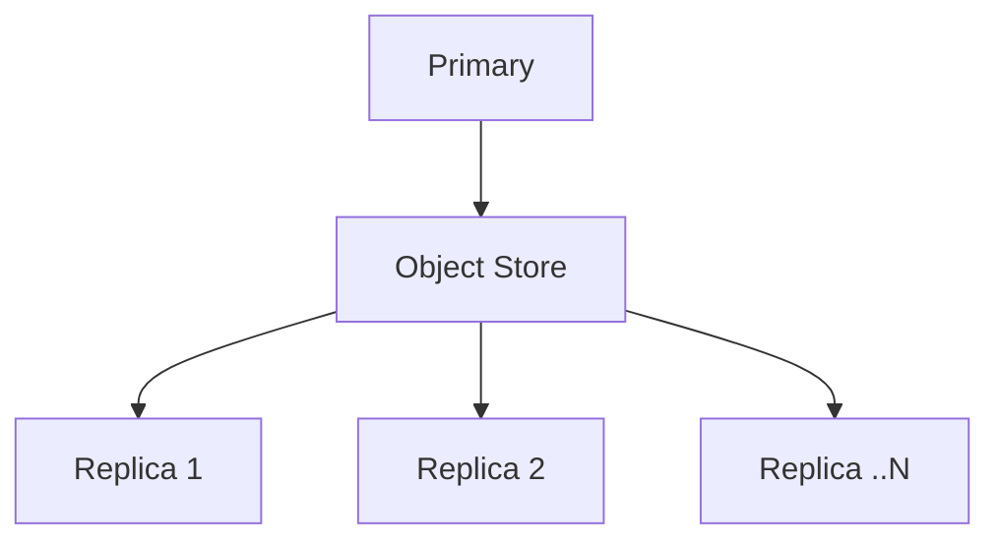

import { EnterpriseNote } from "@site/src/components/EnterpriseNote"

<EnterpriseNote>
  Replication provides high availability and disaster recovery for your QuestDB cluster.
</EnterpriseNote>

QuestDB Enterprise provides **primary-replica replication** for high availability
and disaster recovery. Your data is automatically synced to replica instances
via an object store, with no direct network connections required between nodes.

## Why use replication?

- **High availability** - Replicas can take over if the primary fails
- **Read scaling** - Distribute query load across multiple replicas
- **Disaster recovery** - Restore from any point in time using stored WAL files
- **Geographic distribution** - Place replicas closer to users in different regions
- **Zero performance impact** - Replicas don't affect primary performance

## How it works

The **primary** instance writes data to a
[Write Ahead Log (WAL)](/docs/concept/write-ahead-log/) and uploads these files
to an object store (AWS S3, Azure Blob Storage, GCS, or NFS). **Replica**
instances download and apply these files to stay in sync.

This decoupled architecture means:
- Add or remove replicas without touching the primary
- Replicas can be in different regions or availability zones
- Object store provides durability and point-in-time recovery

## Availability strategies

**Hot availability** - Run replicas continuously alongside the primary for
instant failover. Faster recovery, higher cost.

**Cold availability** - Reconstruct a new primary from the latest snapshot and
WAL files when needed. Slower recovery, lower cost.

## Supported object stores

| Store | Status |
|-------|--------|
| AWS S3 | Supported |
| Azure Blob Storage | Supported |
| Google Cloud Storage | Supported |
| NFS filesystem | Supported |
| HDFS | Planned |

Need something else? [Contact us](/enterprise/contact).

## Requirements

Replication works with **WAL-enabled tables** - tables that have a
[designated timestamp](/docs/concept/designated-timestamp/) and are
[partitioned](/docs/concept/partitions/). This covers most time-series use
cases.

Tables without timestamps (typically used for reference/lookup data) are not
replicated automatically and should be populated separately on each instance.

## Multi-primary ingestion

For even higher throughput, QuestDB Enterprise supports
[multi-primary ingestion](/docs/operations/multi-primary-ingestion/) where
multiple primaries write concurrently to the same logical database.

## Bring Your Own Cloud (BYOC)

QuestDB Enterprise can be self-managed or operated by QuestDB's team under the
[BYOC model](https://questdb.com/byoc/).

With BYOC, QuestDB handles operations of all primary and replica instances on
your infrastructure. Managed infrastructure uses standard cloud provider tools
(CloudFormation for AWS, Lighthouse for Azure) and is fully owned and auditable
by you.

## Next steps

Ready to set up replication? Continue to the [Setup Guide](/docs/operations/replication/).
