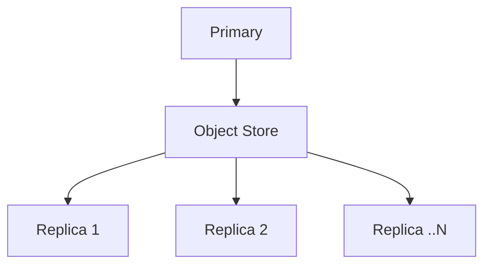
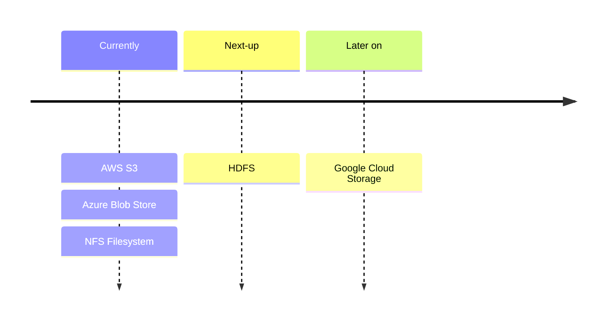

import Screenshot from "@theme/Screenshot"

QuestDB Enterprise offers primary-replica replication with eventual consistency.

This document will teach you about the architecture, some configuration, a
roadmap and limitations.

For a self-hosted setup guide and configuration details, see the
[Replication](/docs/operations/replication) page within Operations.

## Architecture

Replication in QuestDB operates by designating a single **"primary"** database
that uploads [Write Ahead Log (WAL)](/docs/concept/write-ahead-log/) files to a
remote object store. These files can be downloaded and applied by any number of
**"replica"** instances, either continuously or at a later time.

**Primary** instances offer the same features as stand-alone instances, while
**replicas** are read-only, designed to distribute data and load across multiple
locations and instances.

Two common storage strategies are:

- **Hot availability:** A read-only **replica** operates alongside the
  **primary** node, enabling quick switch-over in case of **primary** failure.
  Multiple **replicas** can follow a single **primary**. It is faster and more
  expensive.

- **Cold availability:** A new **primary** node can be reconstructed from the
  latest snapshot and WAL files in the object store, without a constantly
  running replica. It is slower and often cheaper.

Replicating instances communicate via the object store, and not direct network
connections.

This results in a decoupled, flexible architecture with high availability.

Key benefits include:

- **Replica** instances do not impact the performance of the **primary**
  instance, regardless of their number
- Object store-held replication data can enable "point in time recovery",
  restoring an instance to a specific timestamp. This works with full database
  nightly backup snapshots

The architecture consists of:

- A **primary** database instance
- An object store, such as AWS S3 or Azure Blob Storage, or an NFS distributed
  file system
- Any number of **replica** instances

## Supported Object Stores

The [Write Ahead Log (WAL)](/docs/concept/write-ahead-log/) object storage layer
used in QuestDB replication is designed to be plug-able and extensible.

We provide native support for AWS S3, Azure Blob Storage, and the NFS
distributed file system.

HDFS support is on our roadmap.

We also plan to support other object stores such as Google Cloud Storage:

Something missing? Want to see it sooner? [Contact us](/enterprise/contact)!

## Object Store Configuration

The object store is defined in the `replication.object.store` configuration
setting. The string requires a prefix of `s3`, `azblob` or `fs` followed by a
semi-colon-terminated set of key-value pairs.

An example of a replication object store configuration using AWS S3 is:
`replication.object.store=s3::bucket=somename;root=a/path;region=us-east-1;`.

An example of a replication object store configuration using Azure Blob Storage
is:
`replication.object.store=azblob::endpoint=https://someaccount.blob.core.windows.net;container=somename;root=a/path;account_name=someaccount;account_key=somekey;`.

An example of a replication object store configuration using NFS is:
`replication.object.store=fs::root=/mnt/nfs_replication/final;atomic_write_dir=/mnt/nfs_replication/scratch;`

See the [Replication setup guide](/docs/operations/replication) for direct
examples.

<Screenshot
  alt="Two primaries sharing an object store service."
  src="images/docs/concepts/replication-streams.webp"
/>

In addition, the same object store can be re-used for multiple replication
clusters. To do so, provide a unique `DB_INSTANCE_NAME` value.

## Limitations

The replication and point in time recovery features rely on the presence of a
table's [Write Ahead Log (WAL)](/docs/concept/write-ahead-log/) and, for now,
only time series tables. WAL tables have a
[designated timestamp column](/docs/concept/designated-timestamp/) that is
[partitioned](/docs/concept/partitions/).

This covers all tables, except that of tables that are used for referential data
(i.e. SQL JOIN operations) that don't have a timestamp. These generally tend to
contain semi-static data referential data that will have to be updated and kept
up to date manually and are often generally just inserted during the database
tables setup phase.

This limitation will be lifted in the future.

## Multi-primary ingestion

[QuestDB Enterprise](/enterprise/) supports multi-primary ingestion, where
multiple primaries can write to the same database.

See the [Multi-primary ingestion](/operations/multi-primary-ingestion)
page for more information.
