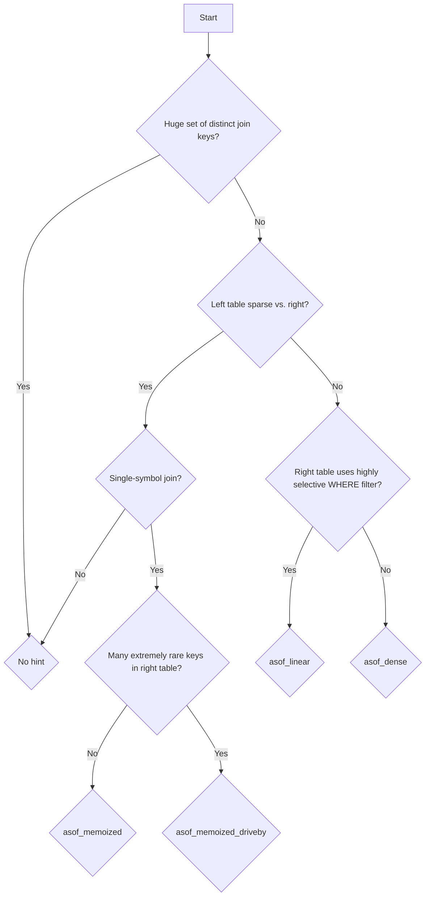

QuestDB's query optimizer automatically selects execution plans for SQL queries
based on heuristics. While the default execution strategy should be the fastest
for most scenarios, you can use hints to select a specific strategy that may
better suit your data's characteristics. SQL hints influence the execution
strategy of queries without changing their semantics.

## Hint Syntax

In QuestDB, you specify SQL hints in block comments with a plus sign after the
opening comment marker. You must place the hint immediately after the `SELECT`
keyword:

```questdb-sql title="SQL hint syntax"
SELECT /*+ HINT_NAME(parameter1 parameter2) */ columns FROM table;
```

Only block comment hints (`/*+ HINT */`) are supported, not line comment hints
(`--+ HINT`).

Hints are designed to be a safe optimization mechanism:

- without hints, QuestDB uses default optimization strategies
- QuestDB silently ignores unknown hints and those that don't apply to a query
- QuestDB silently ignores any syntax errors in a hint block

-----

## Temporal JOIN hints

A significant factor in choosing the optimal algorithm for a temporal join (ASOF
and LT) is the way the rows of the left-hand and right-hand tables (as in
`left ASOF JOIN right`) are aligned on the time axis:

- dense interleaving (similar number of rows per time unit on both sides)
- sparse left-hand rows (many right-hand rows between each two left-hand rows)
- sparse right-hand rows

The "sparse left-hand rows" is a special case that needs its own algorithm, while
the other two are similar from that standpoint.

QuestDB uses two algorithm families:

1. Binary search of the right-hand table to zero in on the row that matches by
   timestamp, then linear backward search to find the row satisfying additional
   join conditions. Great for the "sparse left-hand rows" case.

2. Linear scan over the right-hand table until reaching the left-hand timestamp.
   Great for the other cases.

<Screenshot
alt="Diagram explaining the Fast algorithm"
height={447}
src="images/docs/concepts/asof-join-binary-search-strategy.svg"
width={745}
/>

There are five algorithms:

1. Fast
2. Memoized
3. Memoized with Drive-By Caching
4. Light
5. Dense

Fast and both of the Memoized algos use binary search, Light and Dense use
linear scan.

The default algorithm is _Fast_, and you can enable others through query hints.
For a quick orientation, here's the decision tree:



### List of hints

### `asof_dense(l r)`

This hint enables the [Dense](#dense-algo) algorithm, the best choice (when it's
available) for the dense interleaving of left-hand/right-hand rows.

```questdb-sql title="Applying the query hint for the Dense algorithm"
SELECT /*+ asof_dense(orders md) */
    orders.timestamp, orders.symbol, orders.price
FROM orders
ASOF JOIN (md) ON (symbol);
```

### `asof_linear(l r)`

:::info

This hint applies to `LT` joins as well.

:::

This enables the [Light](#light-algo) algorithm, similar to Dense but simpler.
It has the pitfall of searching through all the history in the RHS table, but is
more generic and available in some queries where the Dense algo isn't.

Also, the light algo is at an advantage when the right-hand side is a subquery
with a WHERE clause that is highly selective, passing through a small number of
rows. QuestDB has parallelized filtering support, which cannot be used with the
other algorithms.

```questdb-sql title="Applying the query hint for the Light algorithm"
SELECT /*+ asof_linear(orders md) */
  orders.ts, orders.price, md.md_ts, md.bid, md.ask
FROM orders
ASOF JOIN (
  SELECT ts as md_ts, bid, ask FROM market_data
  WHERE state = 'INVALID' -- Highly selective filter
) md;
```

### `asof_memoized(l r)`

This hint enables [Memoized](#memoized-algo), a variant of the
[Fast](#fast-algo) algorithm. It works for queries that join on a symbol column,
as in `left ASOF JOIN right ON (symbol)`. It uses additional RAM to remember
where it last saw a symbol in the right-hand table.

This hint will help you if many left-hand rows use a symbol that occurs rarely
in the right-hand table, so that the same right-hand row matches several
left-hand rows. It is especially helpful if some symbols occur way in the past,
because it will search for each such symbol only once.

```questdb-sql title="Appling the query hint for the Memoized algorithm"
SELECT /*+ asof_memoized(orders md) */
    orders.timestamp, orders.symbol, orders.price
FROM orders
ASOF JOIN (md) ON (symbol);
```

### `asof_memoized_driveby(l r)`

This hint enables the [Memoized](#memoized-algo) algo, just like
`asof_memoized(l r)`, but with one more mechanism: the _Drive-By cache_. In
addition to memorizing the previously matched right-hand rows, it remembers the
location of _all_ symbols it encounters during its backward scan. This pays off
when there's a significant number of very rare symbols. While the regular
Memoized Scan searches for each symbol separately, resulting in repeated scans
for rare symbols, the Drive-By Cache allows it to make just one deep backward
scan, and collect all of them.

Maintaining the Drive-By Cache requires a hashtable lookup at every step of the
algorithm, so if it doesn't help finding rare symbols, it will incur an
additional overhead and reduce query performance.

```questdb-sql title="Applying the query hint for the Memoized algorithm with Drive-By Caching"
SELECT /*+ asof_memoized_driveby(orders md) */
    orders.timestamp, orders.symbol, orders.price
FROM orders
ASOF JOIN (md) ON (symbol);
```

### Comparing the algorithms on an example

Let's use the diagram below to explain the key differences among algorithms. It
shows two tables, LHS and RHS. LHS rows are only somewhat less densely
distributed over time than RHS rows. We show the rows aligned on timestamp, so
there are gaps in the LHS column. These gaps don't represent any LHS rows, it is
just the way we visualize the two tables.

The example assumes a JOIN condition which is the most commonplace: joining on a
symbol column. We show the values of that column in the table:

```text
row | LHS | RHS
----|-----|----
 1  |     | G
 2  |     | C
 3  |     | G
 4  |     | A
 5  |     | F
 6  |   A | B
 7  |     | D
 8  |     | B
 9  |   C | G
10  |     | F
11  |     | D
12  |   B | E
13  |     | D
14  |     | C
15  |   A | B
```

#### Light algo

Light algo uses a forward-only scan of the RHS table. When matching the first
RHS symbol (row 6, symbol A), it starts from RHS row 1, and proceeds all the way
to row 6, collecting all the symbols into a hashtable. When done, it looks up
symbol A in the hashtable and finds the prevailing RHS row is row 4. When
matching the next RHS symbol (row 9, symbol C), it resumes the forward scan,
touching rows 7, 8 and 9. Then it looks up symbol C, and finds the prevailing
row is row 2.

#### Fast algo

Fast algo uses binary search over RHS timestamps to zero in on row 6 as the most
recent row not newer than the first LHS row. Then it scans backward: rows 6, 5,
4, and there it finds the matching symbol A. When matching the next LHS symbol
(row 9, symbol C), it uses binary search to zero in on RHS row 9, then scans all
the way back to row 2, where it finds symbol C.

When matching symbol A in row LHS row 15, it uses binary search to zero in or
RHS row 15, then scans backward, again all the way back to row 4.

There's also an optimization that avoids the fixed cost of binary search by
first searching linearly for the matching timestamp in the RHS row, for a
smallish number of steps. This doesn't affect the backward search for the
symbol.

#### Memoized algo

The Memoized algo is a variant of the Fast algo. It uses the exact same
linear/binary search to find the matching timestamp in the RHS, and then uses
the same backward search for the symbol. However, it memorizes for each symbol
where it started the backward search, and where it found it.

In our example, this means it handles the first LHS row (6) exactly the same
way, scanning backward to row 4. But when it encounters the same symbol A in row
15, it scans backward only until reaching row 6, and then directly uses the
remembered result of the previous scan, and matches up with row 4.

With Drive-By caching enabled, Memoized algo will memorize not just the symbol
it's looking for, but also any other symbol. However, it can only memorize it on
the first encounter. This is valuable for rare symbols that occur deep in the
past, but otherwise it just introduces more overhead.

#### Dense algo

The Dense algo starts like the Fast algo, performing a binary search to zero in
on RHS row 6 and searching backward to find symbol A in row 4 of RHS. From then
on, it behaves more like the Light algo.

To match up LHS row 9 (symbol C), it first does a linear scan forward from row 6
to row 9 (exactly like the Light algo). Since it didn't find C in this scan, it
resumes the backward scan, touching rows 3 and 2, and there it finds the symbol
C.

At LHS row 12 (symbol B), it resumes the forward scan, touching rows 10, 11, and
12. Then it finds symbol B in the hashtable, getting row 8 as the prevailing
row. No backward scan nedeed here.

At LHS row 15 (symbol A), it resumes the forward scan, touching rows 13, 14, and
15. Then it looks up symbol A in the hashtable of the forward scan, finding
nothing. Then it looks up symbol A in the hashtable of the backward scan, and
finds it there. The prevailing row is number 4. Again, no backward search was
needed.

#### Discussion

We can see that the Fast and Memoized algos had to touch the most rows.
Especially, when matching row 15, Fast algo had to scan backward to row 4, and
Memoized did only slighly better, scanning until row 6.

Light algo had to initially scan all the history (rows 1 to 6), but from then
on, it only needed to touch the additional rows that came into scope as the LHS
timestamp was moving on.

Dense algo had the same advantage as Light, but it didn't have to scan all the
history. It scanned only as far back into history as needed to find the most
recent occurence of a symbol not yet seen in the forward scan.

If the gaps between LHS rows were much wider, you can see that the binary
search-based algos would have an advantage, as they could skip most of the RHS
table, and find a matching symbol within a relatively short distance back.
This assumes the symbols are spread more-or-less evenly in the RHS table. If
some symbols are extremely rare, a linear scan-based algo may again win.

### RAM considerations

The Fast algorithm is the only one that doesn't use any RAM to store the results
of scanning. It is purely search-based, giving it an additional advantage when
your symbol set is high-cardinality.

-----

### Check the Execution Plan

You can verify how QuestDB executes your query by examining its execution plan
with the `EXPLAIN` statement.

#### Default Execution Plan (Binary Search)

Without any hints, a filtered `ASOF JOIN` will use the Fast algorithm.

```questdb-sql title="Observing the default execution plan" demo
EXPLAIN SELECT  *
FROM core_price
ASOF JOIN market_data
ON symbol
WHERE bids[1,1]=107.03 -- Highly selective filter
;
```

The execution plan will show a `Filtered AsOf Join Fast` operator,
confirming the binary search strategy is being used.

```text
SelectedRecord
    Filter filter: market_data.bids[1,1]=107.03
        AsOf Join Fast
          condition: market_data.symbol=core_price.symbol
            PageFrame
                Row forward scan
                Frame forward scan on: core_price
            PageFrame
                Row forward scan
                Frame forward scan on: market_data
```

#### Hinted Execution Plan (Full Scan)

When you use the `asof_linear` hint, the plan changes.

```questdb-sql title="Observing execution plan with asof_linear query hint" demo
EXPLAIN SELECT /*+ asof_linear(core_price market_data) */
  *
FROM core_price
ASOF JOIN market_data
ON symbol
WHERE bids[1,1]=107.03 -- Highly selective filter
;
```

The execution plan will now show the `AsOf Join Light` operator and a separate,
preceding filtering step on the joined table.

```text
SelectedRecord
    Filter filter: market_data.bids[1,1]=107.03
        AsOf Join Light
          condition: market_data.symbol=core_price.symbol
            PageFrame
                Row forward scan
                Frame forward scan on: core_price
            PageFrame
                Row forward scan
                Frame forward scan on: market_data
```

## Deprecated hints

- `avoid_asof_binary_search`
  - superseded by `asof_linear`
- `avoid_lt_binary_search`
  - superseded by `asof_linear`
- `asof_linear_search`
  - superseded by `asof_linear`
- `asof_index_search`
  - superseded by `asof_index`
- `asof_memoized_search`
  - superseded by `asof_memoized`
