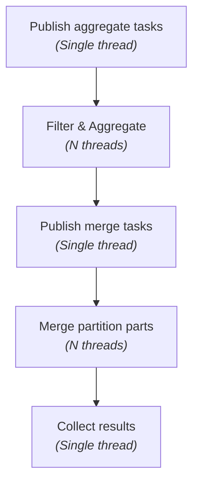

QuestDB offers high-speed ingestion and low-latency analytics on time-series data.


<Screenshot
  alt="QuestDB: High-Speed Ingestion, Low Latency analytics"
  title="QuestDB: High-Speed Ingestion, Low Latency analytics"
  src="images/guides/questdb-internals/questdb-high-level-architecture.svg"
  width={1000}
/>

This document explains QuestDB's internal architecture.

## Key components

QuestDB is comprised of several key components:

- **[Storage engine](#storage-engine):**
  The engine uses a column-oriented design to ensure high I/O performance and low latency.

- **[Memory management and native integration](#memory-management-and-native-integration):**
  The system leverages both memory mapping and explicit memory management techniques,
  and integrates native code for performance-critical tasks.

- **[Query engine](#query-engine):**
  A custom SQL parser, a just-in-time (JIT) compiler, and a vectorized execution engine process
  data in table page frames for better CPU use.

- **[Time-series Optimizations](#time-series-optimizations):**
  QuestDB is specifically designed for time-series, and it provides several optimizations, like a
  designated timestamp, sequential reads, materialized-views, or in-memory processing.

- **[Data ingestion engine](#data-ingestion--write-path):**
  The engine supports bulk and streaming ingestion. It writes data to a row-based write-ahead
  log (WAL) and then converts it into a columnar format. In QuestDB Enterprise, the WAL segments
  ship to object storage for replication.

- **[Networking layer](#networking-layer):**
  The system exposes RESTful APIs and implements ILP and PostgreSQL wire protocols so that
  existing tools and drivers work out-of-the-box. It also offers a health and metrics endpoint.

- **[Replication layer](#replication):**
  QuestDB Enterprise supports horizontal scalability for reads with read replicas, and for
  writes with multi-primary.

- **[Security](#security):**
  QuestDB provides real-time metrics, a health check endpoint, and logging to monitor
  performance and simplify troubleshooting.

- **[Observability](#observability--diagnostics):**
  QuestDB provides real-time metrics, a health check endpoint, and logging to monitor
  performance and simplify troubleshooting.

- **[Web console](#web-console):**
  The engine includes a web console to run SQL statements, bulk load CSV files, and show
  monitoring dashboards. QuestDB Enterprise supports single sign-on (SSO) in the web console.

## Storage engine

### Parallel Write-Ahead-Log

- **Two-phase writes**: All changes to data are recorded in a Write-Ahead-Log (WAL) before they
are written to the database files. This means that in case of a system crash or power failure, the database can recover to a consistent state by replaying the log entries.

- **Commit and write separation**: By decoupling the transaction commit from the disk write process,
a WAL improves the performance of write-intensive workloads, as it allows for sequential disk writes
which are generally faster than random ones.

- **Per-table WAL**: WAL files are separated per table, and also per active connection, allowing for
concurrent data ingestion, modifications, and schema changes without locking the entire table.

- **WAL Consistency**: QuestDB implements a component called "Sequencer", which ensures that data
appears consistent to all readers, even during ongoing write operations.


- **TableWriter**: Changes stored in the WAL, is stored in columnat format by the TableWriter, which
can handle and resolve out-of-order data writes, and enables deduplication. Column files use an
[append model](/docs/concept/storage-model/).

<Screenshot
  alt="Diagram showing WAL files consolidation"
  title="The sequencer allocates unique txn numbers to transactions from different WALs chronologically and serves as the single source of truth, allowing for data deduplication and consolidation."
  src="images/guides/questdb-internals/walData.svg"
  width={1000}
/>


### Data Deduplication

When enabled, [data deduplication](https://questdb.com/docs/concept/deduplication/) works on all the data inserted into
the table and replaces matching rows with the new versions. Only new rows that do no match existing data will be inserted.

Generally, if the data have mostly unique timestamps across all the rows, the performance impact of deduplication is low.
Conversely, the most demanding data pattern occurs when there are many rows with the same timestamp that need to be
deduplicated on additional columns.


### Column-oriented storage

- **Data layout:**
  The system stores each table as separate files per column. Fixed-size data types use one file
  per column, while variable-size data types (such as `VARCHAR` or `STRING`) use two files per column.

<Screenshot
  alt="Architecture of the storage model with column files, readers/writers and the mapped memory"
  title="Architecture of the storage model with multiple column files per partition"
  height={596}
  src="images/guides/questdb-internals/columnarStorage.svg"
  width={400}
/>


- **CPU optimization:**
  Columnar storage improves CPU use during vectorized operations, which speeds up
  aggregations and computations.

- **Compression:**
  Uniform data types allow efficient compression that reduces disk space and speeds up reads
  when [ZFS compression](/docs/guides/compression-zfs/) is enabled. Parquet files generated
  by QuestDB use native compression.

## Memory management and native integration

### Memory-mapped files

- **Direct OS integration:**
  Memory-mapped files let QuestDB use the operating system's page cache. This reduces explicit
  I/O calls and speeds up sequential reads.

- **Sequential access:**
  When data partitions by incremental timestamp, memory mapping ensures that reads are
  sequential and efficient.

### Direct memory management and native integration

- **Off-heap memory usage:**
  QuestDB allocates direct memory via memory mapping and low-level APIs (such as Unsafe) to
  bypass the JVM garbage collector. This reduces latency spikes and garbage collection delays.

- **Hotpath efficiency:**
  The system pre-allocates and reuses memory in critical code paths, avoiding dynamic allocation
  on the hotpath.

- **Native code integration:**
  QuestDB uses native libraries written in C++ and Rust for performance-critical tasks. These
  native components share off-heap buffers with Java via JNI.
  - **Zero-copy interoperability:**
    Sharing memory between Java and native code minimizes data copying and reduces latency.
  - **Hybrid architecture:**
    This integration lets QuestDB use Java for rapid development and C++/Rust for low-level,
    high-performance routines.

## Query engine

### SQL parsing & optimization

- **Custom SQL parser:**
  The parser supports QuestDB's SQL dialect and time-series extensions. It converts SQL queries
  into an optimized abstract syntax tree (AST).

- **Compilation pipeline:**
  The engine compiles SQL into an execution plan through stages that push down predicates and
  rewrite queries to remove unnecessary operations.

- **Optimization techniques:**
  The planner applies rule-based rewrites and simple cost estimations to choose efficient
  execution paths.

- **Columnar reads:**
   Table columns are randomly accessible. Columns with fixed size data types are read by translating
   the record number into a file offset by a simple bit shift. The offset in the column file is then
    translated into an offset in a lazily mapped memory page, where the required value is read from.

<Screenshot
  alt="Diagram showing how the data from a column file is mapped to the memory"
  title="Diagram showing how the data from a column file is mapped to the memory"
  height={447}
  src="images/docs/concepts/columnRead.svg"
  width={745}
/>

### Execution model

- **Operator pipeline:**
  The execution plan runs as a series of operators (filters, joins, aggregators) in a tightly
  integrated pipeline.

<Screenshot
  alt="Query Plan for a query with multi-threaded count with a group by"
  title="Query Plan for a query with multi-threaded count with a group by"
  height={447}
  src="images/guides/questdb-internals/query_plan.webp"
  width={745}
/>

- **JIT compilation and Vectorized processing:**
  Queries with a `WHERE` clause [compile](/docs/concept/jit-compiler) critical parts of the execution plan to native machine code (SIMD AVX-2 instructions) just in time. Vectorised instructions apply
  the same operation to many data elements simultaneously. This maximizes CPU cache use and reduces overhead.

- **Multi-threaded execution:**
  On top of the JIT, QuestDB tries to execute as many queries as possible in a multi-threaded,
  multi-core fashion. Some queries, for example those involving an index, are executed on a single
  thread. Other queries, like those involving `GROUP BY` and `SAMPLE BY`, execute a pipeline with some  single-threaded stages and some multi-threaded stages to avoid slow downs when groups are unbalanced.

<div style={{textAlign: 'center'}}>



</div>

- **Worker pools:** QuestDB allows to configure different pools for specialized functions, like
parsing incoming data, applying WAL file changes, handling PostgreSQL-Wire protocol, or responding to HTTP connections. By default, most tasks are handled by a shared worker pool.

- **Query plan caching:**
  The system caches query plans for reuse within the same connection. (Query results are not
  cached.)

- **Column data caching:**
  Data pages read from disk are kept in system memory. Sufficient memory prevents frequent disk
  reads.


## Time-series optimizations

### Designated timestamp

- **Timestamp sorting:**
  Data stores in order of incremental timestamp. Since ingestion is usually
  chronological, the system uses a fast append-only strategy, except for updates and out-of-order data.

- **Rapid interval queries and sequential reads:**
  Sorted data lets the system quickly locate the start and end of data files, which speeds
  up [interval queries](/docs/concept/interval-scan/). When data is accessed by increasing timestamp,
  reads are sequential for each column file, which makes I/O very efficient.

  <!-- this image is used also at the interval scan concept page. Please keep in sync -->
<Screenshot
  alt="Interval scan"
  title="Interval scan"
  height={433}
  src="images/blog/2023-04-25/interval_scan.svg"
  width={650}
/>

- **Out-of-order data:**
  When data arrives out of order, QuestDB [rearranges it](/docs/concept/partitions/#splitting-and-squashing-time-partitions) to maintain timestamp order. The
  engine splits partitions to minimize [write amplification](/docs/operations/capacity-planning/#write-amplification) and compacts them in the background.


### Data partitioning and sequential reads

- **Partitioning by time:**
  Data [partitions by timestamp](/docs/concept/partitions/) with hourly, daily, weekly, monthly, or yearly resolution.


<!-- This image is used also at the partition concepts page. Please keep in sync -->
<Screenshot
  alt="Diagram of data column files and how they are partitioned to form a table"
  title="Diagram of data column files and how they are partitioned to form a table"
  height={373}
  src="images/docs/concepts/partitionModel.svg"
  width={745}
  forceTheme="dark"
/>


- **Partition pruning:**
  The design lets the engine skip partitions that fall outside query filters. Combined with
  incremental timestamp sorting, this reduces latency.


- **Lifecycle policies:**
  The system can delete partitions manually or automatically via TTL. It also supports
  detaching or attaching partitions using SQL commands.

### Materialized views

  - [Materialize views](https://questdb.com/docs/concept/mat-views/) are auto-refreshing tables storing the pre-computed results of a query. Unlike regular views, which
  compute their results at query time, materialized views persist their data to disk, making them particularly efficient
  for expensive aggregate queries that are run frequently.

  - QuestDB supports materialized views for `SAMPLE BY` queries, including those joining with other tables.

  - Materialized sampled intervals are automatically refreshed whenever the base table receivews new or updated rows.

  - Materialized views can be chained, with the output of one being the input of another one, and support TTLs for lifecycle management.


### In-memory processing

- **Caching:**
  The engine uses the OS cache to access recent and frequently accessed data in memory, reducing
  disk reads.

- **Off-heap buffers:**
  Off-heap memory, managed via memory mapping and direct allocation, avoids garbage
  collection overhead.

- **Optimized in-memory handling:**
  Apart from using CPU-level optimizations such as SIMD, QuestDB uses specialized hash tables (all of them with open
  addressing and linear probing), and implements algorithms for reducing the memory
  footprint of many operations.

- **Custom memory layout for different data types:**
  Specialized data types, like `Symbol`, `VARCHAR`, or `UUID`, are designed to use minimal disk and memory. For example,
  char sequences shorter than 9 bytes are fully inlined within our `VARCHAR` header and do not occupy any additional data space.

 ```text
 Internal Representation of the VARCHAR data type

Varchar header (column file):
+------------+-------------------+-------------------+
| 32 bits    | 48 bits           | 48 bits           |
| len + flags| prefix            | offset            |
+------------+-------------------+-------------------+
                                      │
+------------------------------------+ points to
│
▼
Varchar data (column file):
+---+---+---+---+---+---+---+---+---+---+---+
| H | e | l | l | o |   | w | o | r | l | d |
+---+---+---+---+---+---+---+---+---+---+---+

```

## Data ingestion & write path

### Bulk ingestion

- **CSV ingestion:**
  QuestDB offers a CSV ingestion endpoint via the [REST API](/docs/reference/api/rest/) and web console.
   A specialized COPY command uses [io_uring](/blog/2022/09/12/importing-300k-rows-with-io-uring) on
   fast drives to speed up ingestion.

### Real-time streaming

- **High-frequency writes:**
  The streaming ingestion path handles millions of rows per second with non-blocking I/O.

- **Durability:**
  As seen above, the system writes data to a row-based write-ahead log (WAL) and then converts it
  into column-based files for efficient reads. At the expense of performance, `sync` mode can be
  enabled on commit for extra durability.

- **Concurrent writes:**
  Multiple connections writing to the same table create parallel WAL files that the engine
  later consolidates into columnar storage.

```text

Contents of the `db` folder, showing multiple pending WAL files,
and the binary columnar data.

├── db
│   ├── Table
│   │   │
│   │   ├── Partition 1
│   │   │   ├── _archive
│   │   │   ├── column1.d
│   │   │   ├── column2.d
│   │   │   ├── column2.k
│   │   │   └── ...
│   │   ├── Partition 2
│   │   │   ├── _archive
│   │   │   ├── column1.d
│   │   │   ├── column2.d
│   │   │   ├── column2.k
│   │   │   └── ...
│   │   ├── txn_seq
│   │   │   ├── _meta
│   │   │   ├── _txnlog
│   │   │   └── _wal_index.d
│   │   ├── wal1
│   │   │   └── 0
│   │   │       ├── _meta
│   │   │       ├── _event
│   │   │       ├── column1.d
│   │   │       ├── column2.d
│   │   │       └── ...
│   │   ├── wal2
│   │   │   └── 0
│   │   │   │   ├── _meta
│   │   │   │   ├── _event
│   │   │   │   ├── column1.d
│   │   │   │   ├── column2.d
│   │   │   │   └── ...
│   │   │   └── 1
│   │   │       ├── _meta
│   │   │       ├── _event
│   │   │       ├── column1.d
│   │   │       ├── column2.d
│   │   │       └── ...
│   │   │
│   │   ├── _meta
│   │   ├── _txn
│   │   └── _cv

```

### Ingestion via ILP protocol

- **Native ILP integration:**
  QuestDB supports the [Influx Line Protocol](/docs/reference/api/ilp/overview/)
   (ILP) for high-speed data ingestion.

- **Extensions to ILP:**
  QuestDB extends ILP to support different timestamp units and the array data type.

- **Minimal parsing overhead:**
  The ILP parser quickly maps incoming data to internal structures.

- **Parallel ingestion:**
  The ILP path uses off-heap buffers and direct memory management to bypass JVM heap  allocation.

- **Protocol versatility:**
  In addition to ILP, QuestDB also supports ingestion via [REST](/docs/reference/sql/overview/#rest-http-api)
  and [PostgreSQL wire](/docs/reference/sql/overview/#postgresql) protocols.

## Replication

- **Read replicas:** QuestDB uses object storage (via NFS, S3, Azure Blob Storage, or GCS)
and read replicas. Both local, cross-zonal, and cross-regional replication patterns are
supported. The architecture is described at the [replication concepts](/docs/concept/replication/)
page.

- **Write replicas:** QuestDB allows [multi-primary ingestion](/docs/operations/multi-primary-ingestion/), which allows both increasing the write throughput, and enabling
high availabilty. A [distributed sequencer](/docs/operations/multi-primary-ingestion/#distributed-sequencer-with-foundationdb) makes sure transactions are conflict-free, and
tracks status of the cluster to enable instance discovery and automatic failover.


## Networking layer

QuestDB exposes several network interfaces and protocols to allow different client applications to interact with the database

<Screenshot
  alt="QuestDB Network Protocols"
  title="QuestDB Network Protocols"
  src="images/guides/questdb-internals/questdb_network_protocols.svg"
  width={734}
/>

### InfluxDB Line protocol (ILP) over HTTP or TCP

The [Influx Line Protocol](/docs/reference/api/ilp/overview/) allows for very high throughput of incoming data. It supports
both HTTP (recommended) or TCP. QuestDB provides official clients in seven different programming languages, as well as
integrations with third-party tools like Apache Kafka, Apache Flink, or Telegraf. Any ILP-compatible library can be used
for ingesting data into QuestDB over HTTP.

The default port number for ILP over HTTP is `9000`, and for ILP over TCP is `9009`.

### PostgreSQL wire protocol

QuestDB exposes a [PostgreSQL wire](/docs/reference/sql/overview/#postgresql) protocol, which can be used to send SQL
statements both for data definition or for data manipulation. When used for data ingestion, throughput is noticeably
lower than using the ILP protocol.

QuestDB implements the wire protocol, allowing many third-party libraries to query QuestDB directly. Some client libraries
might be incompatible if they rely heavily on PostgreSQL metadata, as QuestDB implements only a subset of it. For an
overview of some key differences on QuestDB schema design, please visit our
[Schema Design Essentials](/docs/guides/schema-design-essentials/) guide.

The default port number for the pg-wire interface is `8812`.

### HTTP Rest API

QuestDB [REST API](/docs/reference/sql/overview/#rest-http-api) can be used to issue SQL statements over HTTP. It also
exposes and endpoint for importing CSV files, and for exporting tables and query results.

The default port number for the REST API is `9000`.

### Minimal HTTP server for health-check and metrics

QuestDB exposes an HTTP interface for monitoring. Please see the [Observability](#observability--diagnostics) section
for more information.

The default port number for the minimal HTTP server is `9003`.

## Security

- **Built-in admin and read-only users:**
  QuestDB includes built-in admin and read-only users for the pgwire protocol and HTTP endpoints using HTTP Basic Auth.

- **HTTP basic authentication:**
  You can enable HTTP Basic Authentication for the HTTP API, web console, and pgwire
  protocol. Health-check and metrics endpoints can be configured independently.

- **Token-based authentication:**
  QuestDB Enterprise offers HTTP and JWT token authentication. QuestDB Open Source
  supports token authentication for ILP over TCP.

- **TLS on all protocols:**
  QuestDB Enterprise supports TLS on all protocols and endpoints.

- **Single sign-on:**
  QuestDB Enterprise supports SSO via OIDC with Active Directory, EntraID, or OAuth2.

- **Role-based access control:**
  Enterprise users can create user groups and assign service accounts and users.
   Grants [can be configured](/docs/operations/rbac/) individually or at the
   group level with fine granularity, including column-level  access.

<!-- This image is used also at the operations rbac page. Please keep in sync -->
<Screenshot
  alt="Diagram showing users, service accounts and groups in QuestDB"
  title="Users, service accounts and groups"
  src="images/docs/acl/users_service_accounts_groups.webp"
  width={745}
/>


## Observability & diagnostics

- **Metrics:**
  QuestDB exposes detailed [metrics in Prometheus format](/docs/operations/logging-metrics/#metrics), including query
  statistics, memory usage, and I/O details.

- **Health check:**
  A [minimal HTTP server](/docs/operations/logging-metrics/#minimal-http-server) monitors system health.

- **Metadata tables:**
  The engine provides [metadata tables](/docs/reference/function/meta/) to query
   table status, partition status, query execution, and latency.

- **Extensive logging:**
  [Logging](/docs/operations/logging-metrics/) covers SQL parsing, execution, background processing, and runtime exceptions. The framework minimizes performance impact.

- **Real-time metric dashboards:**
  The web console lets you create dashboards that display per-table metrics.

<Screenshot
  alt="Metric dashboard at the QuestDB Console"
  title="Metric dashboard at the QuestDB Console"
  height={447}
  src="images/guides/questdb-internals/telemetry.webp"
  width={745}
/>

## Web Console

The [QuestDB Web console](/docs/web-console/) is ideal for interactive exploration, and implements:

- **SQL Editor** featuring tabs and SQL autocompletion.
- **Table and Materialized View** explorer.
- **CSV import** manager.
- **Single-sign-on**, when enabled for enterprise users.
- **Basic Auth**, when enabled for both OSS and Enterprise users.
- **Real-time metric dashboards**, to track transactions throughput, latency, and write amplification.

<Screenshot
  alt="The QuestDB Console"
  title="The QuestDB Web Console"
  src="images/guides/questdb-internals/web-console.webp"
  width={745}
/>


## Design patterns & best practices throughout the code base

- **Immutable data structures:**
  The system favors immutability to avoid concurrency issues and simplify state
  management.

- **Modular architecture:**
  Each component (storage, query processing, ingestion, etc.) has well-defined interfaces that enhance maintainability.

- **Factory & builder patterns:**
  The engine uses these patterns to centralize construction logic for complex objects like SQL  execution plans and storage buffers.

- **Lazy initialization:**
  Resource-intensive components initialize only when needed to reduce startup overhead.

- **Rigorous testing & benchmarks:**
  [Unit tests, integration tests](https://github.com/questdb/questdb/tree/master/core/src/test),
  and performance benchmarks ensure that new enhancements do  not compromise
  reliability or speed.

## Further reading & resources

- [QuestDB GitHub Repository](https://github.com/questdb/questdb)
- [QuestDB Documentation](/docs)
