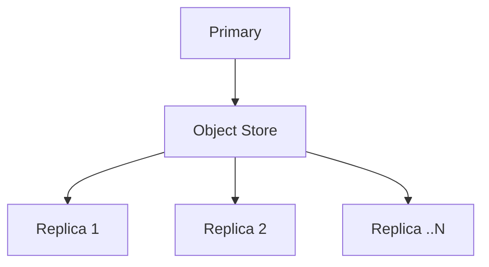

import { EnterpriseNote } from "@site/src/components/EnterpriseNote"

<EnterpriseNote>
  Primary-replica replication is a QuestDB Enterprise feature. Client failover
  and store-and-forward are available to all native clients.
</EnterpriseNote>

QuestDB approaches high availability in two layers, and a resilient deployment
usually needs both:

- **Server-side replication** keeps a hot copy of your data on one or more
  replica nodes, so the cluster survives the loss of a node. This is a QuestDB
  Enterprise feature, and it is the main subject of this page.
- **Client-side resilience** keeps your applications connected across the
  failover that replication makes possible.
  [Client failover](/docs/high-availability/client-failover/concepts/) lets a
  client walk a list of hosts when its connection breaks, and
  [store-and-forward](/docs/high-availability/store-and-forward/concepts/)
  buffers unacknowledged data locally so a producer never loses writes during
  the gap.

Replication moves the data; the client-side features make sure your
applications follow it. The rest of this page covers replication — see the
**Client Failover** and **Store-and-Forward** sections for the client side.

## Why use replication?

- **High availability** - Replicas can take over if the primary fails
- **Read scaling** - Distribute query load across multiple replicas
- **Disaster recovery** - Restore from any point in time using stored WAL files
- **Geographic distribution** - Place replicas closer to users in different regions
- **Zero performance impact** - Replicas don't affect primary performance

## How it works

The **primary** instance writes data to a
[Write Ahead Log (WAL)](/docs/concepts/write-ahead-log/) and uploads these files
to an object store (AWS S3, Azure Blob Storage, GCS, or NFS). **Replica**
instances download and apply these files to stay in sync.

This decoupled architecture means:
- Add or remove replicas without touching the primary
- Replicas can be in different regions or availability zones
- Object store provides durability and point-in-time recovery

## Availability strategies

**Hot availability** - Run replicas continuously alongside the primary for
instant failover. Faster recovery, higher cost.

**Cold availability** - Reconstruct a new primary from the latest snapshot and
WAL files when needed. Slower recovery, lower cost.

## Supported object stores

| Store | Status |
|-------|--------|
| AWS S3 | Supported |
| Azure Blob Storage | Supported |
| Google Cloud Storage | Supported |
| NFS filesystem | Supported |
| HDFS | Planned |

Need something else? [Contact us](/enterprise/contact).

## Requirements

Replication works with **WAL-enabled tables** - tables that have a
[designated timestamp](/docs/concepts/designated-timestamp/) and are
[partitioned](/docs/concepts/partitions/). This covers most time-series use
cases.

Tables without timestamps (typically used for reference/lookup data) are not
replicated automatically and should be populated separately on each instance.

## Storage policies in a replicated cluster

[Storage policy](/docs/concepts/storage-policy/) definitions are stored in
WAL-backed system tables, so the policy itself — the `TO PARQUET`,
`DROP NATIVE`, and `DROP LOCAL` TTLs and the active/disabled status — is
replicated to every instance through the same WAL pipeline as user data.

Enforcement, however, runs **independently on each instance**. Parquet files
are produced locally and are not replicated; each node's storage policy job
schedules its own `PARQUET_CONVERSION`, `PARQUET_COMMIT`, and `DROP_LOCAL`
work against its local data. As a result:

- At any given moment a partition may be in different states across the
  primary and its replicas (e.g. already converted on the primary but still
  native on a replica that hasn't yet hit its check interval).
- These differences are temporary. Once each instance's check job runs and
  processes the partition, the cluster converges to the same logical state.
- Tuning the [check interval](/docs/concepts/storage-policy/#configuration)
  (`storage.policy.check.interval`) or worker count
  (`storage.policy.worker.count`) per instance lets you trade conversion
  latency against background load on that node.

## Bring Your Own Cloud (BYOC)

QuestDB Enterprise can be self-managed or operated by QuestDB's team under the
[BYOC model](https://questdb.com/byoc/).

With BYOC, QuestDB handles operations of all primary and replica instances on
your infrastructure. Managed infrastructure uses standard cloud provider tools
(CloudFormation for AWS, Lighthouse for Azure) and is fully owned and auditable
by you.

## Next steps

- [Setup Guide](/docs/high-availability/setup/) — configure object storage, the
  primary, and replica nodes.
- [Client failover](/docs/high-availability/client-failover/concepts/) —
  configure your applications to follow a primary promotion automatically.
- [Store-and-forward](/docs/high-availability/store-and-forward/concepts/) —
  buffer unacknowledged writes on the client so a producer survives an outage
  without data loss.
