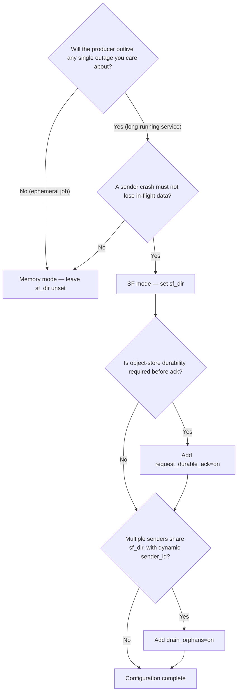

The QWP WebSocket transport always uses a store-and-forward (SF) substrate.
What changes between deployments is **where** that substrate keeps unacked
data and **what durability bar** it acknowledges against. This page is the
decision guide.

If you are new to SF, start with
[Concepts](/docs/high-availability/store-and-forward/concepts/).

## Memory mode vs SF mode

The single switch that decides this is whether you set `sf_dir` in the
connect string.

### Memory mode — `sf_dir` unset

Unacked frames live in a malloc'd ring in process memory. Default cap is
`128 MiB`.

**Choose memory mode when:**

- The producer process is short-lived or ephemeral (a CLI job, a CI
  worker, a serverless function).
- A sender restart is acceptable as a fresh start — losing any in-flight
  data when the sender stops is acceptable.
- You only need to tolerate **transient** network blips and short server
  outages (think: rolling upgrades, brief network partitions).
- Your data volume comfortably fits in RAM during the longest outage you
  care about.

### SF mode — `sf_dir=/path/to/slot-root`

Unacked frames are written to mmap'd files under
`<sf_dir>/<sender_id>/`. Default cap is `10 GiB`.

**Choose SF mode when:**

- The producer process is long-running and must ride out outages measured in
  minutes or hours. A running sender retries indefinitely, so what caps your
  tolerance is how much unacked data you can hold: `sf_max_total_bytes` and
  the disk behind `sf_dir`, not a timer.
- In-flight data must not be lost when the sender stops or its host
  reboots — crash, OOM kill, planned redeploy.
- You ingest at rates where minutes of buffering exceeds RAM you can
  spare.
- You operate unattended at the edge (sensors, ETL jobs) where the
  server may sometimes be unreachable for extended periods.

Both modes share the same wire behaviour, the same failover loop, and
the same connect-string keys for everything other than storage. You can
switch between them without changing application code — only the connect
string.

## Comparison at a glance

| Aspect | Memory mode | SF mode |
|---|---|---|
| Buffered data location | Process RAM | Disk (`<sf_dir>/<sender_id>/`) |
| Default capacity | `128 MiB` | `10 GiB` |
| Unacked data after a sender crash (`kill -9`, OOM) | Lost | Recovered and replayed on restart |
| Unacked data after the sender's host reboots | Lost | Recovered, if the disk persists |
| Cross-sender rescue (orphan adoption) | n/a | Yes (opt-in) |
| Setup cost | Zero | Provisioning a writable directory |
| Operational cost | Zero | Sizing, monitoring, lock collisions |

## Durable-ack: when to opt in

By default the substrate trims unacked data after the server's OK response.
An OK confirms a WAL commit, but is not itself a promise that the transaction
has reached durable storage.

Set `request_durable_ack=local` to retain the frame until QuestDB confirms that
the WAL transaction is durable on the primary's disk. This requires a WAL table
and `cairo.commit.mode=adaptive`. Set `request_durable_ack=replicated` (or its
legacy alias, `on`) to retain the frame until `STATUS_DURABLE_ACK` confirms that
the WAL reached the configured object store (S3, Azure Blob, GCS, or NFS).

### Choose durable-ack when

- Use `local` when power-loss-safe durability on one server is sufficient and
  you want to retain the client copy until that boundary.
- Use `replicated` when loss of the primary and its disk must not lose in-flight
  data, or for compliance and cross-region recovery requirements.
- You are willing to trade later trim, and therefore larger steady-state SF
  storage use, for the selected guarantee.

### Stay on the default OK trim when

- Your upstream source can replay the server's local durability window.
- You want minimum steady-state storage use.
- The server does not support the durability tier you require.

### Caveats

- **Server support is required.** The server must echo the complete requested
  tier set in `X-QWP-Durable-Ack`. A missing, partial, or different grant makes
  the connection fail loudly. The legacy `on` request uses `true` on the wire
  and expects `enabled`.
- **Local mode prerequisite.** OSS can grant `local`, but the watermark advances
  only for adaptive WAL tables. Since `nosync` is the server default, enabling
  `local` without adaptive mode can leave the sender waiting indefinitely.
- **Idle keepalive.** The server only flushes pending durable-ack frames during
  inbound receive events. The client sends a WebSocket PING every
  `durable_ack_keepalive_interval_millis` (default 200 ms) while confirmations
  are pending and the producer is idle.
- **Disk pressure.** Steady-state SF disk usage is roughly
  `ingest_rate × time_to_requested_durability`. Size `sf_max_total_bytes`
  accordingly.

## Orphan adoption: when to enable

A sender that exits without draining its slot leaves unacked data on
disk. If another process restarts under the same `sender_id` and same
`sf_dir`, it picks up the orphan automatically as part of normal
recovery. But if no process ever uses that `sender_id` again, the data
sits on disk forever.

Setting `drain_orphans=on` tells the **foreground sender** to scan
`<sf_dir>/*` at startup for sibling `sender_id`s with unacked data and
spawn background drainers to clear them.

### Enable orphan adoption when

- You have a fleet of senders writing to a shared `sf_dir` (multi-tenant
  host, container restart) and want any survivor to rescue dead
  siblings' data.
- Your deployment can dynamically allocate `sender_id` (e.g. one per
  process instance), so dead instances leave permanent orphans that no
  natural restart will adopt.
- You prefer "automatic eventual delivery" over "operator manually
  reattaches the slot."

### Leave it off when

- Each `sender_id` is statically pinned to a specific process — there
  are no orphans by construction; a restart of the same process
  recovers its own slot.
- You want explicit operator control over data movement in a shared
  `sf_dir`.
- You run a single producer per host.

Drainer concurrency is capped by `max_background_drainers` (default
`4`). Each drainer opens its own connection — they share the network
path but not the WebSocket.

`drain_orphans=on` does not interfere with regular recovery: the
foreground sender still recovers its own `sender_id` first, then
drainers spawn for sibling slots.

## Migrating from HTTP/TCP ILP

If you are currently using HTTP or TCP ILP ingest, the comparison is:

| Capability | HTTP ILP | TCP ILP | QWP WebSocket + SF |
|---|---|---|---|
| Non-blocking producer | No (request waits) | No (TCP backpressure) | Yes (buffer absorbs publishes) |
| No data loss on a sender crash | No | No | Yes (SF mode) |
| Server outage tolerance | Best-effort retry | None | Reconnect loop with multi-minute budget |
| Multi-host failover | Yes (HTTP only) | No | Yes |
| Cross-region durability ack | No | No | Yes (`request_durable_ack=on`) |
| Cluster-wide ordering | Best-effort | Best-effort | FSN-driven, server-deduplicated |

The transition is application-transparent — `Sender.fromConfig` accepts
a `ws::` or `wss::` connect string and the public builder API is the
same. The most common migration is HTTP ILP → QWP WS+SF, with `sf_dir`
set, retaining HTTP for backward compatibility while the QWP path
becomes the primary.

For specifically the multi-host HA path on HTTP ILP, see the existing
[ILP overview "Multiple URLs for High Availability"](/docs/connect/compatibility/ilp/overview/#multiple-urls-for-high-availability)
section. QWP failover (documented in
[Client failover concepts](/docs/high-availability/client-failover/concepts/))
replaces and extends it.

## Decision flowchart

```mermaid
graph TD
    Q1{Will the producer outlive any single outage you care about?}
    Q2{A sender crash must not lose in-flight data?}
    Q3{Is object-store durability required before ack?}
    Q4{Multiple senders share sf_dir, with dynamic sender_id?}

    Q1 -->|"No (ephemeral job)"| Memory[Memory mode — leave sf_dir unset]
    Q1 -->|"Yes (long-running service)"| Q2
    Q2 -->|No| Memory
    Q2 -->|Yes| SF[SF mode — set sf_dir]
    SF --> Q3
    Q3 -->|Yes| Durable[Add request_durable_ack=on]
    Q3 -->|No| Q4
    Durable --> Q4
    Q4 -->|Yes| Orphans[Add drain_orphans=on]
    Q4 -->|No| Done[Configuration complete]
    Orphans --> Done
```

## Next steps

- [Configuration](/docs/high-availability/store-and-forward/configuration/) —
  the connect-string keys.
- [Operating and tuning](/docs/high-availability/store-and-forward/operating-and-tuning/) —
  slot layout, sizing, observability.
