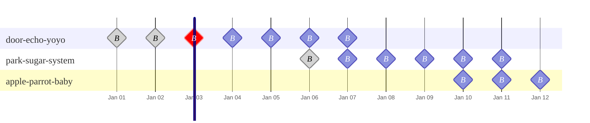

import { EnterpriseNote } from "@site/src/components/EnterpriseNote"

<EnterpriseNote>
  Automatic cleanup of replicated WAL data in object storage.
</EnterpriseNote>

QuestDB's [replication feature](/docs/high-availability/setup/) streams
write-ahead log (WAL) data from a primary node to object storage, where replica
nodes consume it. Without cleanup, this replicated WAL data accumulates
indefinitely. The WAL cleaner runs on the primary node and automatically deletes
data that is no longer needed, based on your backup and checkpoint history,
keeping storage usage under control.

The WAL cleaner is _enabled by default_ and keeps as much replication data as your latest N backups or checkpoints:

```ini
# server.conf (the are defaults — no action needed)
replication.primary.cleaner.enabled=true
replication.primary.cleaner.backup.window.count=5
```

Each WAL cleaner cycle runs every 10 minutes by default
(`replication.primary.cleaner.interval`).

The cleaner requires at least one **cleanup trigger source** before it will delete
anything. The two supported sources are:

- **[Enterprise backups](/docs/operations/backup/)** — the cleaner reads backup
  manifests to determine what can be safely deleted
- **[Checkpoint history](#integrating-with-the-sql-checkpoint-commands)** — the cleaner reads
  `CHECKPOINT RELEASE` records synced to the replication object store

Both sources are enabled by default when replication is active. If you only
use one backup method, the cleaner simply ignores the source that has no
history.

The core principle is simple: the cleaner retains enough WAL data to support
your most recent N backups or checkpoints, and deletes everything older.


## Integrating with Enterprise backups

The cleaner automatically reads your backup manifests to determine what can be
safely deleted. The backup feature must be enabled and configured on the
primary, even if you only run backups from a replica.

```ini
# server.conf (primary)
replication.role=primary
replication.object.store=...
backup.enabled=true
backup.object.store=s3::bucket=my-backup-bucket;...  # same on all cluster nodes
```

The cleaner waits until at least N complete backups exist before it starts
deleting anything. N defaults to your
[`backup.cleanup.keep.latest.n`](/docs/operations/backup/#backup-retention)
setting (itself default 5) and can be overridden with
`replication.primary.cleaner.backup.window.count`. For example, with the default
of 5 the cleaner deletes data older than the 5th-newest complete backup.

:::warning
All nodes in a replication cluster should use the **same `backup.object.store`**
connection string. The cleaner on the primary reads backup manifests from every
node to compute the cleanup boundary. If nodes back up to different object
stores, the cleaner cannot see all manifests and will not trigger correctly.
:::

## Integrating with the SQL CHECKPOINT commands

If you take filesystem snapshots, AWS EBS volume snapshots, or use custom backup
scripts that issue `CHECKPOINT` / `CHECKPOINT RELEASE`, checkpoint history
tracking is all you need.

Both `checkpoint.history.enabled` and
`replication.primary.cleaner.checkpoint.source` default to `true` when
replication is enabled, so no extra configuration is required:

```ini
# server.conf — checkpoint history works out of the box
replication.role=primary  # or replica
replication.object.store=...
```

Checkpoint history does not need to be configured on the primary. It only needs
to be enabled on the node(s) where you actually run checkpoints. For example,
you might run a primary and two replicas, and back up both replicas but not the
primary. As long as each node that issues checkpoints is part of the same
replication cluster and has checkpoint history enabled, the cleaner on the
primary will see their checkpoint records.

Each time `CHECKPOINT RELEASE` runs on any node with checkpoint history enabled,
QuestDB records the per-table transaction state to the shared replication object
store. The cleaner uses these records the same way it uses backup manifests.

As with backups, the cleaner waits until at least N complete checkpoints exist
before deleting anything. N is controlled by
`replication.primary.cleaner.backup.window.count` (default 5).

Checkpoint records are synced to the replication object store at
`checkpoint_history/{instance_name}/history.msgpack`. If the sync fails
transiently, QuestDB retries in the background (controlled by
`checkpoint.history.long.retry.interval`).

:::note
`CHECKPOINT` itself is available in both OSS and Enterprise, but checkpoint
history tracking, the mechanism that syncs checkpoint records to the
replication object store for WAL cleanup, requires QuestDB Enterprise with
replication enabled.
:::

## Operational Notes

### Mixing Backups and Checkpoints

By default, both trigger sources are enabled:

```ini
backup.enabled=true
checkpoint.history.enabled=true
replication.primary.cleaner.checkpoint.source=true
```

The cleaner merges both sources and always picks the more conservative (older)
boundary, so data is not deleted until it is safe according to **both** your
backups and your checkpoints.

### Disabling the cleaner

```ini
replication.primary.cleaner.enabled=false
```

With the cleaner disabled, WAL data accumulates indefinitely. Useful for
debugging, not recommended for production.

## Cleanup boundary and recovery range

The cleanup boundary determines the oldest point from which you can restore a
backup and still replay WAL data to rejoin the replication cluster. Any
[point-in-time recovery](/docs/high-availability/setup/#point-in-time-recovery)
target must be at or after this boundary.

Each node in a replication cluster has a unique **backup instance name**. You can
find a node's backup instance name by running:

```questdb-sql
SELECT backup_instance_name;
```

Backup manifests and checkpoint history records are stored per backup instance
name. The cleaner computes the boundary as follows:

1. For each instance name, read the most recent N complete entries (backups or
   checkpoints, regardless of source). N is
   `replication.primary.cleaner.backup.window.count` (default 5).
2. Ignore any instance that has fewer than N entries.
3. From all remaining entries across eligible instances, pick the **oldest**
   one. That is the cleanup boundary — WAL data before it is deleted.


In this example with N=5:



- Considered entries (backups or checkpoints):
  - **door-echo-yoyo** has 7 entries. Its 5th newest entry of the 3rd of Jan is considered.
  - **park-sugar-system** has 6 entries. Its 5th entry (Jan 7th) is considered.
  - **apple-parrot-baby** has only 3, fewer than N, so it is skipped.
- The oldest most recent 5th entry is of **door-echo-yoyo**, so the cleanup boundary falls on Jan 3. All replication WAL data before it is deleted.
- After cleanup, restoring from a backup older than Jan 3 (such as door-echo-yoyo's Jan 1 or Jan 2 backups) is only possible as a standalone instance and not as part of the replication cluster.
- Any point-in-time recovery target must be **on or after** Jan 3.

### Abandoned backup instance names

Notice that door-echo-yoyo has no backups after Jan 7. If it is a
decommissioned node, its old history is dragging the cleanup boundary back to
Jan 3. Without it, the boundary would jump forward to Jan 7
(park-sugar-system's oldest eligible entry), freeing several days of WAL
data. The cleaner is conservative and assumes every instance is still active.

If a node is decommissioned without removing its history from the object store,
its stale entries hold back the cleanup boundary indefinitely.

You can identify this from the cleaner's log. Each cleanup cycle logs:

```
prune requested [c=1, trigger=backup, instance=door-echo-yoyo, backup_ts=1771597937483926 (2026-02-20T14:32:17.483926Z), tables=42]
```

If `instance` shows a name you don't recognise or one that belongs to a
decommissioned node, that instance is holding things back. If `backup_ts`
is unexpectedly old, that confirms the boundary is being dragged behind by
abandoned history.

To unblock cleanup, delete the abandoned backup instance name's directory. The
location depends on the source:

In the **backup** object store:

```
backup/{backup_instance_name}/
```

In the **replication** object store:

```
checkpoint_history/{backup_instance_name}/
```

You can discover which backup instance names exist by listing these prefixes in
your object store.

## Configuration reference

All settings go in `server.conf`. Defaults are tuned for typical production
use — most deployments only need the quick-start settings above.

### Core settings

| Property | Default | Description |
|---|---|---|
| `replication.primary.cleaner.enabled` | `true` | Master switch for the cleaner. |
| `replication.primary.cleaner.interval` | `10m` | Time between cleanup cycles. Range: 1s – 24h. |
| `replication.primary.cleaner.checkpoint.source` | `true` | Use checkpoint history as a cleanup trigger source. |
| `replication.primary.cleaner.backup.window.count` | `backup.cleanup.keep.latest.n` (if backups enabled) or 5 | Minimum complete backups/checkpoints per instance before cleanup starts. |

### Performance tuning

| Property | Default | Description |
|---|---|---|
| `replication.primary.cleaner.delete.concurrency` | 4 – 12 (auto) | Concurrent deletion tasks. Derived from `replication.requests.max.concurrent`. Range: 4 – 32. |
| `replication.primary.cleaner.max.requests.per.second` | Service-dependent | Rate limit for object store requests. Set to 0 for unlimited. Range: 0 – 10000. |
| `replication.primary.cleaner.progress.write.interval` | `5s` | How often progress is persisted during a cycle. Lower = less re-work after crash, more writes. Range: 100ms – 60s. |

Default rate limits per object store:

| Service | Default | Basis |
|---|---|---|
| GCS | 500 req/s | 50% of ~1,000 write ops/s per bucket |
| Azure Blob | 10,000 req/s | 50% of ~20,000 requests/s per account |
| S3 / R2 / DO Spaces | 1,750 req/s | 50% of ~3,500 DELETE/s per prefix |
| Filesystem | 100 req/s | Conservative default for potential NFS |

### Safety settings

| Property | Default | Description |
|---|---|---|
| `replication.primary.cleaner.dropped.table.cooloff` | `1h` | Wait time after `DROP TABLE` before removing the table's data from object storage. Guards against clock skew. |
| `replication.primary.cleaner.retry.attempts` | `20` | Retries for transient object store failures. Range: 0 – 100. |
| `replication.primary.cleaner.retry.interval` | `2s` | Delay between retries. Range: 0 – 5m. |

### Checkpoint history settings

Only relevant when `checkpoint.history.enabled=true`.

| Property | Default | Description |
|---|---|---|
| `checkpoint.history.enabled` | `true` (when replication is enabled) | Enable the checkpoint history tracker. Requires replication. |
| `checkpoint.history.keep.count` | `100` | Maximum checkpoint records retained per instance. |
| `checkpoint.history.long.retry.interval` | `1m` | Retry interval for syncing to object store after burst retries fail. |

The remaining checkpoint history settings (`requests.retry.attempts`,
`requests.retry.interval`, `requests.max.concurrent`, timeouts, throughput)
default to the corresponding `replication.requests.*` values and rarely need
to be overridden.

## Logging

You can find the WAL cleaner's logs grepping for `wal::uploader::cleaner`.
