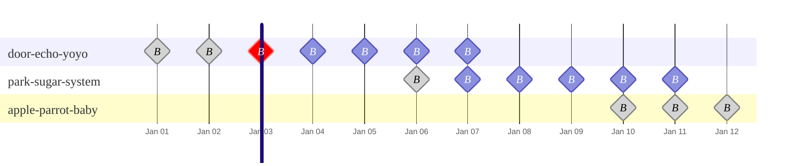

import { EnterpriseNote } from "@site/src/components/EnterpriseNote"

<EnterpriseNote>
  Automatic cleanup of replicated WAL data in object storage.
</EnterpriseNote>

QuestDB's [replication feature](/docs/high-availability/setup/) streams
write-ahead log (WAL) data from a primary node to object storage, where replica
nodes consume it. Without cleanup, this replicated WAL data accumulates
indefinitely. The **WAL cleaner** runs on the primary node and automatically
deletes data that is no longer needed, keeping storage usage under control.

Requires: QuestDB Enterprise with replication enabled.

:::warning
The WAL cleaner is enabled by default, **but it will not delete anything until
at least 5 completed backups or checkpoints exist.** Without configuring backups
or checkpoint history, and executing regular backups, WAL data accumulates
indefinitely regardless of this setting.
:::

## Quick start

The WAL cleaner is _enabled by default_. With either backups or checkpoint
history active, no additional configuration is needed:

```ini
# server.conf (these are defaults — no action needed)
replication.primary.cleaner.enabled=true
replication.primary.cleaner.backup.window.count=5
```

It runs every 10 minutes (`replication.primary.cleaner.interval`).

The cleaner requires at least one **trigger source** with sufficient history
before it will delete anything. The two supported sources are:

- **[Enterprise backups](/docs/operations/backup/)** — the cleaner reads backup
  manifests to determine what can be safely deleted.
- **[Checkpoint integration](#checkpoint-integration)** — the cleaner reads
  `CHECKPOINT RELEASE` records synced to the replication object store.

Both sources are enabled by default when replication is active. If you only use
one backup method, the cleaner simply ignores the source that has no history.

## Verifying cleanup is running

Search the QuestDB logs for `wal::uploader::cleaner`. Each cleanup cycle logs a
line like:

```
prune requested [c=1, trigger=backup, instance=door-echo-yoyo, backup_ts=1771597937483926 (2026-02-20T14:32:17.483926Z), tables=42]
```

Key fields:

| Field | Meaning |
|---|---|
| `trigger` | Which source determined the boundary (`backup` or `checkpoint`). |
| `instance` | The backup instance name whose entry set the boundary. |
| `backup_ts` | Timestamp of the boundary entry. Data up to and including this entry is deleted. |
| `tables` | Number of tables processed in this cycle. |

If the cleaner does not have enough history to act, it logs:

```
insufficient backup history, skipping WAL cleanup [backup_window_count=5, history={door-echo-yoyo:3, park-sugar-system:2}]
```

This means no instance has reached the N-entry threshold yet. Check that
backups or checkpoints are running successfully.

You can find a node's backup instance name by running:

```questdb-sql
SELECT backup_instance_name;
```

## Backup integration

The cleaner automatically reads your backup manifests to determine what can be
safely deleted. The backup feature must be enabled and configured on the
primary, even if you only run backups from a replica.

```ini
# server.conf (primary)
replication.role=primary
replication.object.store=...
backup.enabled=true
backup.object.store=s3::bucket=my-backup-bucket;...  # same on all cluster nodes
```

The cleaner waits until at least N complete backups exist before it starts
deleting anything. N defaults to your
[`backup.cleanup.keep.latest.n`](/docs/operations/backup/#backup-retention)
setting (itself default 5) and can be overridden with
`replication.primary.cleaner.backup.window.count`. For example, with the default
of 5 the cleaner deletes data up to and including the 5th-newest complete backup, which becomes the oldest backup from which a node can be restored into the replication cluster.

:::warning
All nodes in a replication cluster should use the **same `backup.object.store`**
connection string. The cleaner on the primary reads backup manifests from every
node to compute the cleanup boundary. If nodes back up to different object
stores, the cleaner cannot see all manifests and will not trigger correctly.
:::

## Checkpoint integration

If you take filesystem snapshots, AWS EBS volume snapshots, or use custom backup
scripts that issue `CHECKPOINT` / `CHECKPOINT RELEASE`, checkpoint history
tracking is all you need.

Both `checkpoint.history.enabled` and
`replication.primary.cleaner.checkpoint.source` default to `true` when
replication is enabled, so no extra configuration is required:

```ini
# server.conf — checkpoint history works out of the box
replication.role=primary  # or replica
replication.object.store=...
```

Checkpoint history does not need to be configured on the primary. It only needs
to be enabled on the node(s) where you actually run checkpoints. For example,
you might run a primary and two replicas, and back up both replicas but not the
primary. As long as each node that issues checkpoints is part of the same
replication cluster and has checkpoint history enabled, the cleaner on the
primary will see their checkpoint records.

Each time `CHECKPOINT RELEASE` runs on any node with checkpoint history enabled,
QuestDB records the per-table transaction state to the shared replication object
store. The cleaner uses these records the same way it uses backup manifests.

As with backups, the cleaner waits until at least N complete checkpoints exist
before deleting anything. N is controlled by
`replication.primary.cleaner.backup.window.count` (default 5).

Checkpoint records are synced to the replication object store at
`checkpoint_history/{instance_name}/history.msgpack`. If the sync fails
transiently, QuestDB retries in the background (controlled by
`checkpoint.history.long.retry.interval`).

:::note
`CHECKPOINT` itself is available in both OSS and Enterprise, but checkpoint
history tracking — the mechanism that syncs checkpoint records to the
replication object store for WAL cleanup — requires QuestDB Enterprise with
replication enabled.
:::

## How the cleanup boundary works

The cleanup boundary determines how far back you can restore. WAL data up to
and including the boundary is deleted; data after the boundary is retained. Any
[point-in-time recovery](/docs/high-availability/setup/#point-in-time-recovery)
target must be **after** this boundary.

Backup manifests and checkpoint history records are stored per backup instance
name. The cleaner computes the boundary as follows:

1. For each backup instance name, collect the most recent N entries (backups or
   checkpoints, regardless of source). N is
   `replication.primary.cleaner.backup.window.count` (default 5).
2. Skip any instance that has fewer than N entries.
3. Compare the Nth-newest entry from each eligible instance. The entry with the
   **earliest timestamp** is the cleanup boundary — WAL data up to and including
   that entry's transactions is deleted.

### Example

Consider three nodes with N=5: **door-echo-yoyo** has 7 entries (Jan 1–7),
**park-sugar-system** has 6 entries (Jan 6–11), and **apple-parrot-baby** has 3
entries (Jan 10–12).

Skipped and not considered:
- **apple-parrot-baby** has only 3 entries, fewer than N=5, so it is skipped.

The following entries are considered by the algorithm:
- **door-echo-yoyo** has 7 entries. Its 5th newest entry is **Jan 3**.
- **park-sugar-system** has 6 entries. Its 5th newest entry is **Jan 7**.

Comparing Jan 3 (door-echo-yoyo) vs Jan 7 (park-sugar-system): the earliest
is **Jan 3**, so the cleanup boundary falls
there. All replication WAL data up to and including Jan 3 is deleted.
After cleanup, restoring from a backup older than Jan 3 (such as
door-echo-yoyo's Jan 1 or Jan 2 backups) is only possible as a standalone
instance, not as part of the replication cluster.
Any point-in-time recovery target must be **after** Jan 3.



Greyed-out entries in the diagram are not considered by the algorithm.

## Using both backups and checkpoints

By default, both trigger sources are active:

```ini
backup.enabled=true
checkpoint.history.enabled=true
replication.primary.cleaner.checkpoint.source=true
```

Backups and checkpoints are merged into a single list per backup instance name
before the boundary is computed. The effect depends on your cluster topology:

- **Same instance produces both backups and checkpoints** — more entries
  accumulate per instance, crossing the N threshold sooner and pushing the
  Nth-newest entry forward in time. This more eagerly reduces the time window
  of data kept in the replication object store.
- **Different instances produce backups vs checkpoints** — each instance has
  fewer entries individually, and the cross-instance comparison in step 3 picks
  the oldest boundary. This increases the time window of data retained.

To restrict the cleaner to a single source, set
`replication.primary.cleaner.checkpoint.source=false` to ignore checkpoint
history, or disable `backup.enabled` to ignore backup manifests.

## Troubleshooting

### Storage growing despite cleaner being enabled

1. **Check that trigger sources have enough history.** The cleaner needs at
   least N entries (default 5) from at least one backup instance name. If you
   recently set up replication and have fewer than 5 backups or checkpoints, the
   cleaner has not started yet. Run `SELECT * FROM backups();` or check your
   checkpoint schedule.

2. **Check the logs.** Search for `wal::uploader::cleaner`. If you see
   `insufficient backup history, skipping WAL cleanup`, the cleaner is not
   finding enough history to act.

3. **Check for abandoned backup instance names.** A decommissioned node whose
   history remains in the object store drags the cleanup boundary backward
   indefinitely. See [Abandoned backup instance names](#abandoned-backup-instance-names).

4. **Verify both sources are producing entries.** When both backups and
   checkpoints are enabled, entries from both are merged per instance. If one
   source stopped producing entries (e.g., scheduled backups are failing), the
   total entry count per instance may drop below N, preventing cleanup. Check
   that all configured sources are running on schedule.

### Abandoned backup instance names

A decommissioned node whose history is still in the object store holds back the
cleanup boundary for the entire cluster. In the [example above](#example),
door-echo-yoyo has no entries after Jan 7. If it is decommissioned, its old
history pins the boundary to Jan 3. Without it, the boundary would advance to
Jan 7 (park-sugar-system's 5th newest entry).

You can identify this from the cleaner log:

```
prune requested [c=1, trigger=backup, instance=door-echo-yoyo, backup_ts=1771597937483926 (2026-02-20T14:32:17.483926Z), tables=42]
```

If `instance` shows a name you don't recognize or one belonging to a
decommissioned node, and `backup_ts` is unexpectedly old, that instance is the
problem.

To unblock cleanup, delete the abandoned instance's directory from the object
store:

In the **backup** object store:

```
backup/{backup_instance_name}/
```

In the **replication** object store:

```
checkpoint_history/{backup_instance_name}/
```

You can discover which backup instance names exist by listing these prefixes in
your object store.

### Cleanup boundary not advancing

If the `backup_ts` in the cleaner log stays the same across cycles:

- An instance may have stopped producing new backups or checkpoints. Check that
  all active nodes are backing up on schedule.
- The N-entry threshold may be too high. Lowering
  `replication.primary.cleaner.backup.window.count` reduces how many entries
  are required before cleanup starts, but also reduces your recovery window.

### Disabling the cleaner

```ini
replication.primary.cleaner.enabled=false
```

With the cleaner disabled, WAL data accumulates indefinitely. Useful for
debugging, not recommended for production.

## Configuration reference

All settings go in `server.conf`. Defaults are tuned for typical production
use — most deployments only need the quick-start settings above.

### Core settings

| Property | Default | Description |
|---|---|---|
| `replication.primary.cleaner.enabled` | `true` | Master switch for the cleaner. |
| `replication.primary.cleaner.interval` | `10m` | Time between cleanup cycles. Range: 1s – 24h. |
| `replication.primary.cleaner.checkpoint.source` | `true` | Use checkpoint history as a cleanup trigger source. |
| `replication.primary.cleaner.backup.window.count` | `backup.cleanup.keep.latest.n` (if backups enabled) or 5 | Minimum complete backups/checkpoints per instance before cleanup starts. |

### Performance tuning

| Property | Default | Description |
|---|---|---|
| `replication.primary.cleaner.delete.concurrency` | 4 – 12 (auto) | Concurrent deletion tasks. Derived from `replication.requests.max.concurrent`. Range: 4 – 32. |
| `replication.primary.cleaner.max.requests.per.second` | Service-dependent | Rate limit for object store requests. Set to 0 for unlimited. Range: 0 – 10000. |
| `replication.primary.cleaner.progress.write.interval` | `5s` | How often progress is persisted during a cycle. Lower = less re-work after crash, more writes. Range: 100ms – 60s. |

Default rate limits per object store:

| Service | Default | Basis |
|---|---|---|
| GCS | 500 req/s | 50% of ~1,000 write ops/s per bucket |
| Azure Blob | 10,000 req/s | 50% of ~20,000 requests/s per account |
| S3 / R2 / DO Spaces | 1,750 req/s | 50% of ~3,500 DELETE/s per prefix |
| Filesystem | 100 req/s | Conservative default for potential NFS |

### Safety settings

| Property | Default | Description |
|---|---|---|
| `replication.primary.cleaner.dropped.table.cooloff` | `1h` | Wait time after `DROP TABLE` before removing the table's data from object storage. Guards against clock skew. |
| `replication.primary.cleaner.retry.attempts` | `20` | Retries for transient object store failures. Range: 0 – 100. |
| `replication.primary.cleaner.retry.interval` | `2s` | Delay between retries. Range: 0 – 5m. |

### Checkpoint history settings

Only relevant when `checkpoint.history.enabled=true`.

| Property | Default | Description |
|---|---|---|
| `checkpoint.history.enabled` | `true` (when replication is enabled) | Enable the checkpoint history tracker. Requires replication. |
| `checkpoint.history.keep.count` | `100` | Maximum checkpoint records retained per instance. |
| `checkpoint.history.long.retry.interval` | `1m` | Retry interval for syncing to object store after burst retries fail. |

The remaining checkpoint history settings (`requests.retry.attempts`,
`requests.retry.interval`, `requests.max.concurrent`, timeouts, throughput)
default to the corresponding `replication.requests.*` values and rarely need
to be overridden.
