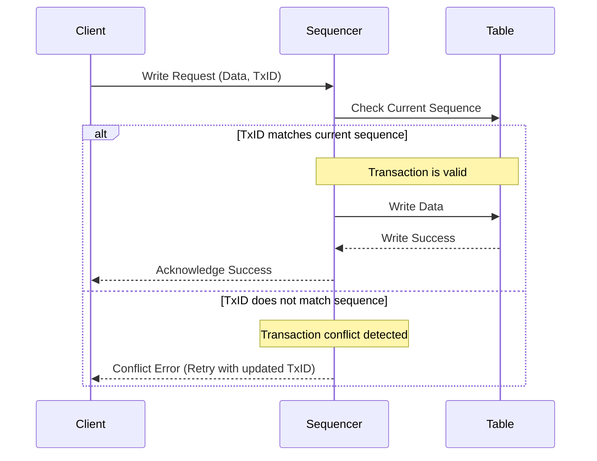

QuestDB Enterprise's multi-primary ingestion enables **strong throughput** and **high availability** via concurrent writes across multiple primaries. With the addition of **automatic failover**, it provides reliable ingestion under most failure and zero-downtime update scenarios.

Multi-primary ingestion applies multiple primary nodes to handle parallel ingestion operations. Each primary node can sustain up to **5 million rows per second** as per [Time Series Benchmark Suite (TSBS)](https://github.com/questdb/tsbs) benchmarks.

This document explains multi-primary ingestion, and provides details on the use of FoundationDB for metadata coordination, a sequencer for conflict resolution, and failover mechanisms for added reliability. 

:::note

Multi-primary ingestion is coming soon to QuestDB Enterprise.

:::

## How multi-primary ingestion works

### The role of the sequencer

QuestDB Enterprise provides write consistency across multiple primary nodes via a **sequencer**. The sequencer coordinates transactions by assigning **monotonic transaction numbers** to writes.

Each primary behaves as both a primary and a replica. It will write data into the [object store](/concept/replication/#supported-object-stores) and read data from the [object store](/concept/replication/#supported-object-stores) written by the other primaries to catch up with any changes.

This approach is already used by QuestDB, even on single-instance configuration, for managing writes via **WAL files** and has been extended to support multi-primary setups:

Broken down, here is how it works:

* **Transaction sequencing:** Each write operation is assigned a unique transaction ID. The sequencer ensures that this ID is always **incremental** and consistent for the target table. Transaction sequencing is managed **per table**, so each table has an independent sequence.

* **Optimistic locking:** When a write request is received, the sequencer validates the transaction number. If the transaction number is lower than the current sequence for the table, the write is rejected with a conflict error.

* **Error handling:** If a transaction conflict occurs, QuestDB Enterprise notifies the client with an error message. The client can retry the transaction with updated data.

### Distributed sequencer with FoundationDB

In a multi-primary configuration, the sequencer operates in a **distributed mode**. It does so with [FoundationDB](https://www.foundationdb.org/) as the backend for storing transaction metadata. This enables synchronization across primaries.

- **Cluster-wide coordination:** The metadata about transaction IDs for each table is maintained in FoundationDB. This allows all primaries to verify and update sequence numbers without conflicts.

- **Dynamic primary selection:** Clients can send writes directly to a specific primary node or to the cluster address. When writing to the cluster address, data is automatically routed to the most optimal primary node based on the current load and availability.

- **Conflict resolution:** As in single-primary setups, transaction conflicts are handled by rejecting conflicting writes and informing the client to resend the data.

With FoundationDB for metadata coordination, and a robust sequencer for conflict resolution, QuestDB Enterprise provides the resiliency your team needs to scale with peace of mind.

## Automatic failover

QuestDB Enterprise's multi-primary architecture also supports **automatic failover** to ensure high availability in case of primary node failures. This feature minimizes downtime and maintains ingestion continuity.

### Failover workflow

1. **Primary and replica registration:**
    - All **primaries** and **replicas** register with the FoundationDB coordinator on startup.
    - This provides the cluster with a complete view of the topology, including all active primaries and replicas.
1. **Failure detection:**
    - The cluster continuously monitors the health of primary nodes.
    - If a primary becomes unresponsive due to hardware issues, a restart, or other failures, the cluster initiates a failover.
1. **Replica promotion:**
    - A suitable replica is automatically promoted to **primary** based on its synchronization status and availability.
    - The new primary information is propagated to all connected clients using the official QuestDB Enterprise SDK.
    - If the client is connected to the cluster address, writes are seamlessly redirected to the new primary.
1. **Reintegration of the failed primary:**
    - The failed primary undergoes a recovery process, catching up with the latest transactions using the **Write Ahead Log (WAL)** from the cluster.
    - Once synchronized, the recovered primary is reinstated, and the promoted replica returns to its previous role as a replica.

## Configuration and topology awareness

When configuring a QuestDB Enterprise cluster with multi-primary ingestion:

- **Coordinator setup:** Both primary nodes and replicas must be configured to communicate with the FoundationDB coordinator.

- **Client awareness:** Clients using the official QuestDB Enterprise SDK receive the cluster topology on connection. This allows them to:
    - Select a specific primary for writes.
    - Send data to the cluster address for automatic routing.

- **Seamless failover:** During failover events, clients are automatically informed of topology changes, ensuring uninterrupted ingestion.

