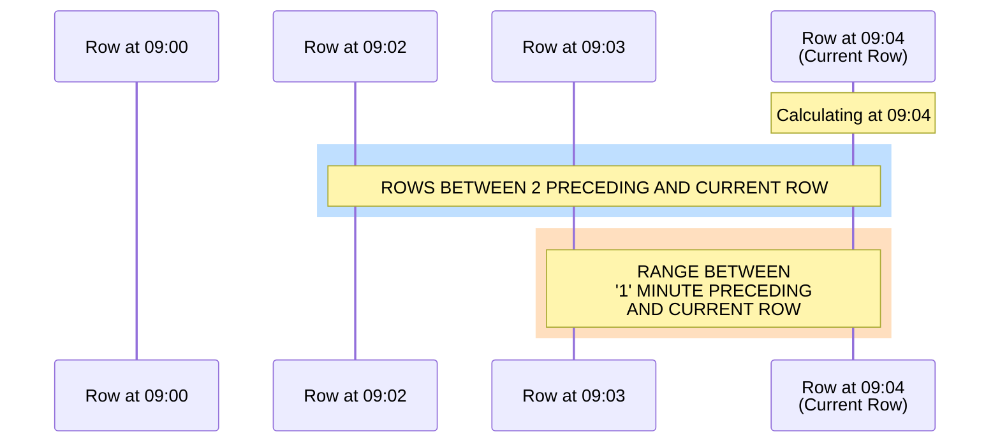
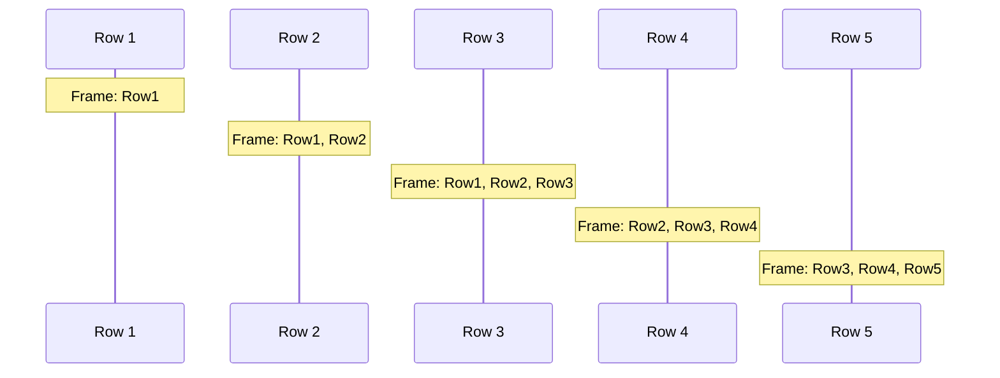
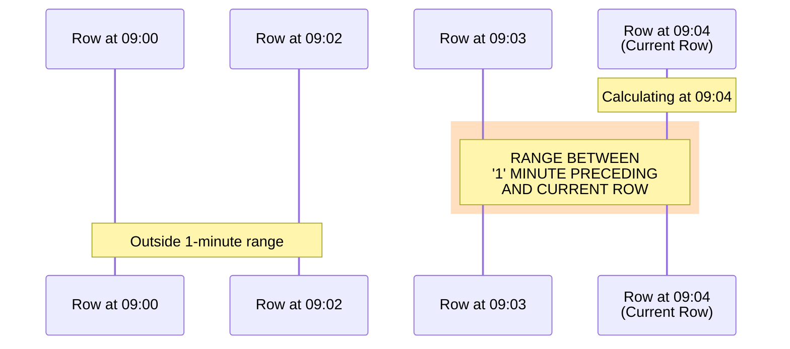
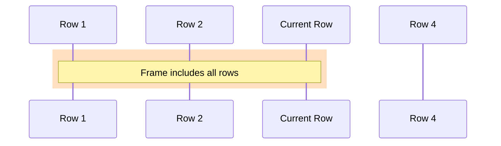
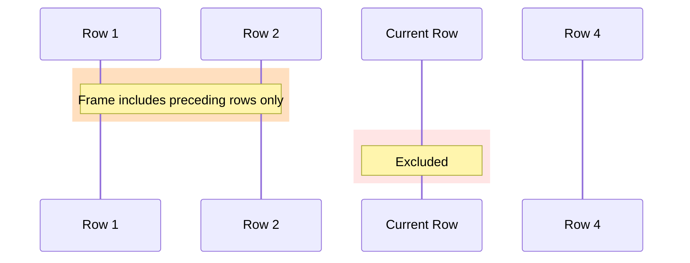

The `OVER` clause defines the window for a window function. This page covers the complete syntax for partitioning, ordering, and frame specifications. For an introduction to window functions, see the [Overview](overview.md).

:::tip
Click **Demo this query** within our query examples to run them in our live demo.
:::

## Syntax

```sql
function_name(arguments) [IGNORE NULLS | RESPECT NULLS] OVER (
    [PARTITION BY column [, ...]]
    [ORDER BY column [ASC | DESC] [, ...]]
    [frame_clause]
    [exclusion_clause]
)
```

Where `frame_clause` is one of:
```sql
ROWS | RANGE BETWEEN frame_start AND frame_end
ROWS | RANGE frame_start
CUMULATIVE
```

And `frame_start` is one of:
```sql
UNBOUNDED PRECEDING
<value> PRECEDING
CURRENT ROW
```

And `frame_end` is one of:
```sql
CURRENT ROW
<value> FOLLOWING
UNBOUNDED FOLLOWING
```

For `ROWS` frames, `<value>` is an integer (number of rows). For `RANGE` frames, `<value>` is a time interval like `'1' MINUTE` or `'5' SECOND`.

And `exclusion_clause` is:
```sql
EXCLUDE CURRENT ROW | EXCLUDE NO OTHERS
```

| Component | Description |
|-----------|-------------|
| `IGNORE NULLS` | Skip null values when evaluating the function |
| `RESPECT NULLS` | Include null values (default behavior) |
| `PARTITION BY` | Divides the result set into partitions |
| `ORDER BY` | Orders rows within each partition |
| `ROWS \| RANGE` | Defines the window frame relative to current row |
| `CUMULATIVE` | Shorthand for `ROWS BETWEEN UNBOUNDED PRECEDING AND CURRENT ROW` |
| `EXCLUDE` | Optionally excludes rows from the frame |

## PARTITION BY

`PARTITION BY` divides the result set into groups. The window function operates independently on each partition.

```questdb-sql title="Partition by symbol" demo
SELECT
    symbol,
    price,
    avg(price) OVER (PARTITION BY symbol) AS avg_price_per_symbol
FROM trades
WHERE timestamp IN today()
LIMIT 100;
```

- Without `PARTITION BY`, all rows are treated as a single partition
- Multiple columns can be specified: `PARTITION BY symbol, exchange`

## ORDER BY

`ORDER BY` within the `OVER` clause determines the logical order for window calculations.

```questdb-sql title="Order within partition" demo
SELECT
    symbol,
    price,
    timestamp,
    row_number() OVER (
        PARTITION BY symbol
        ORDER BY timestamp
    ) AS seq
FROM trades
WHERE timestamp IN today()
LIMIT 100;
```

**Important:**
- This is independent of the query-level `ORDER BY`
- Required for ranking functions (`row_number`, `rank`, `dense_rank`)
- Required for `RANGE` frames
- Required for `CUMULATIVE`
- Without `ORDER BY`, all rows in the partition are peers

:::tip Time-series optimization
For tables with a designated timestamp column, data is already ordered by time. When your `ORDER BY` matches the designated timestamp, QuestDB's optimizer recognizes this and skips redundant sorting. You still need to specify `ORDER BY` for cumulative calculations, but there's no performance penalty.
:::

## IGNORE NULLS / RESPECT NULLS

The `IGNORE NULLS` and `RESPECT NULLS` clauses control how null values are handled by certain window functions. These clauses appear **before** the `OVER` keyword.

**Supported functions:** `first_value()`, `last_value()`, `lag()`, `lead()`

### RESPECT NULLS (default)

By default, null values are included in the evaluation. This is equivalent to explicitly specifying `RESPECT NULLS`:

```questdb-sql title="Default behavior - nulls included"
SELECT
    timestamp,
    price,
    lag(price) OVER (ORDER BY timestamp) AS prev_price
FROM trades;
```

If the previous row has a null `price`, `prev_price` will be null.

### IGNORE NULLS

With `IGNORE NULLS`, the function skips over null values to find the next non-null value:

```questdb-sql title="Skip null values"
SELECT
    timestamp,
    price,
    lag(price) IGNORE NULLS OVER (ORDER BY timestamp) AS prev_non_null_price
FROM trades;
```

This returns the most recent non-null `price` value, skipping any intermediate nulls.

**Common use cases:**
- **Filling gaps**: Use `first_value() IGNORE NULLS` or `last_value() IGNORE NULLS` to carry forward/backward the last known value
- **Sparse data**: Use `lag() IGNORE NULLS` to reference the previous actual measurement, ignoring missing readings

## Frame types and behavior

Window frames specify which rows are included in the calculation relative to the current row.



### ROWS frame

Defines the frame based on a physical number of rows:

```questdb-sql
ROWS BETWEEN 2 PRECEDING AND CURRENT ROW
```

This includes exactly 3 rows: the current row and two preceding rows.



**Example:**
```questdb-sql title="3-row moving average" demo
SELECT
    symbol,
    price,
    timestamp,
    avg(price) OVER (
        PARTITION BY symbol
        ORDER BY timestamp
        ROWS BETWEEN 2 PRECEDING AND CURRENT ROW
    ) AS moving_avg_3
FROM trades
WHERE timestamp IN today()
LIMIT 100;
```

### RANGE frame

Defines the frame based on values in the `ORDER BY` column rather than row count.

:::note
RANGE frames have a known limitation: rows with the same ORDER BY value ("peers") do not produce identical results as required by the SQL standard. QuestDB currently processes peers as distinct rows rather than treating them as a group. See [GitHub issue #5177](https://github.com/questdb/questdb/issues/5177).
:::

**Requirements:**
- Data must be ordered by the designated timestamp column
- The window is calculated based on timestamp values

```questdb-sql
RANGE BETWEEN '1' MINUTE PRECEDING AND CURRENT ROW
```

With a current row at 09:04, this includes all rows with timestamps between 09:03 and 09:04 (inclusive).



**Supported time units:**

| Unit | Plural |
|------|--------|
| `day` | `days` |
| `hour` | `hours` |
| `minute` | `minutes` |
| `second` | `seconds` |
| `millisecond` | `milliseconds` |
| `microsecond` | `microseconds` |

**Example with multiple intervals:**
```questdb-sql title="Multiple time-based windows" demo
SELECT
    timestamp,
    bids[1,1] AS best_bid,
    bids[2,1] AS volume_l1,
    AVG(best_bid) OVER (
        ORDER BY timestamp
        RANGE BETWEEN '5' MINUTE PRECEDING AND CURRENT ROW
    ) AS avg_5min,
    COUNT(*) OVER (
        ORDER BY timestamp
        RANGE BETWEEN '100' MILLISECOND PRECEDING AND CURRENT ROW
    ) AS updates_100ms,
    SUM(volume_l1) OVER (
        ORDER BY timestamp
        RANGE BETWEEN '2' SECOND PRECEDING AND CURRENT ROW
    ) AS volume_2sec
FROM market_data
WHERE timestamp IN today()
LIMIT 100;
```

This query demonstrates different time intervals in action:
- 5-minute moving average of best bid price (in the example table, `bids[1]` contains bid prices and `bids[2]` contains bid sizes)
- Update frequency in 100ms windows
- 2-second rolling volume

Note that each window calculation is based on the timestamp values, not the number of rows. The number of rows included can vary depending on how many records exist within each time interval.

### CUMULATIVE shorthand

`CUMULATIVE` is a convenient shorthand for running totals and cumulative calculations. It's equivalent to `ROWS BETWEEN UNBOUNDED PRECEDING AND CURRENT ROW`.

**Requirements:**
- `ORDER BY` clause is required

```questdb-sql title="Cumulative sum using CUMULATIVE"
SELECT
    symbol,
    price,
    timestamp,
    sum(price) OVER (
        PARTITION BY symbol
        ORDER BY timestamp
        CUMULATIVE
    ) AS running_total
FROM trades
WHERE timestamp IN today();
```

This is equivalent to:
```questdb-sql title="Cumulative sum - explicit form"
SELECT
    symbol,
    price,
    timestamp,
    sum(price) OVER (
        PARTITION BY symbol
        ORDER BY timestamp
        ROWS BETWEEN UNBOUNDED PRECEDING AND CURRENT ROW
    ) AS running_total
FROM trades
WHERE timestamp IN today();
```

**VWAP example:**

For high-frequency data, VWAP is typically calculated over OHLC using typical price:

```questdb-sql title="Volume-weighted average price over OHLC" demo
DECLARE @symbol := 'BTC-USD'

WITH ohlc AS (
    SELECT
        timestamp AS ts,
        first(price) AS open,
        max(price) AS high,
        min(price) AS low,
        last(price) AS close,
        sum(amount) AS volume
    FROM trades
    WHERE timestamp IN '2024-05-22' AND symbol = @symbol
    SAMPLE BY 1m ALIGN TO CALENDAR
)
SELECT
    ts, open, high, low, close, volume,
    sum((high + low + close) / 3 * volume) OVER (ORDER BY ts CUMULATIVE)
        / sum(volume) OVER (ORDER BY ts CUMULATIVE) AS vwap
FROM ohlc;
```

### Frame shorthand syntax

When you omit `BETWEEN ... AND`, the frame end defaults to `CURRENT ROW`:

| Shorthand | Equivalent |
|-----------|------------|
| `ROWS UNBOUNDED PRECEDING` | `ROWS BETWEEN UNBOUNDED PRECEDING AND CURRENT ROW` |
| `ROWS 5 PRECEDING` | `ROWS BETWEEN 5 PRECEDING AND CURRENT ROW` |
| `RANGE '1' MINUTE PRECEDING` | `RANGE BETWEEN '1' MINUTE PRECEDING AND CURRENT ROW` |
| `CUMULATIVE` | `ROWS BETWEEN UNBOUNDED PRECEDING AND CURRENT ROW` |

**Example:**
```questdb-sql title="Shorthand frame syntax"
SELECT
    timestamp,
    price,
    -- These are equivalent:
    sum(price) OVER (ORDER BY timestamp ROWS UNBOUNDED PRECEDING) AS sum1,
    sum(price) OVER (ORDER BY timestamp ROWS BETWEEN UNBOUNDED PRECEDING AND CURRENT ROW) AS sum2,
    sum(price) OVER (ORDER BY timestamp CUMULATIVE) AS sum3
FROM trades
WHERE timestamp IN today();
```

## Frame boundaries

Frame boundaries determine which rows are included:

| Boundary | Description |
|----------|-------------|
| `UNBOUNDED PRECEDING` | First row of the partition |
| `<value> PRECEDING` | N rows/interval before current row |
| `CURRENT ROW` | The current row |
| `<value> FOLLOWING` | N rows/interval after current row (limited support) |
| `UNBOUNDED FOLLOWING` | Last row of partition (only when start is `UNBOUNDED PRECEDING`) |

### Default frames

When frame clause is omitted:

| Scenario | Default Frame |
|----------|---------------|
| No `ORDER BY` | Entire partition (all rows are peers) |
| With `ORDER BY` | `RANGE UNBOUNDED PRECEDING` (start to current row) |

### Restrictions

1. **Frame start** can only be:
   - `UNBOUNDED PRECEDING`
   - `<value> PRECEDING`
   - `CURRENT ROW`

2. **Frame end** can only be:
   - `CURRENT ROW`
   - `<value> FOLLOWING`
   - `UNBOUNDED FOLLOWING` (only when start is `UNBOUNDED PRECEDING`)

3. `RANGE` frames must be ordered by a designated timestamp

4. `CUMULATIVE` requires an `ORDER BY` clause

## Exclusion options

### EXCLUDE NO OTHERS (default)

Includes all rows in the frame:



### EXCLUDE CURRENT ROW

Excludes the current row from frame calculations:



When the frame ends at `CURRENT ROW`, `EXCLUDE CURRENT ROW` automatically adjusts the end boundary to `1 PRECEDING`.

**Example:**
```questdb-sql title="Cumulative sum excluding current row" demo
SELECT
    timestamp,
    price,
    SUM(price) OVER (
        ORDER BY timestamp
        ROWS BETWEEN UNBOUNDED PRECEDING AND CURRENT ROW
        EXCLUDE CURRENT ROW
    ) AS cumulative_sum_excluding_current
FROM trades
WHERE timestamp IN today()
LIMIT 100;
```

## Performance considerations

- **ROWS frames** typically perform better than RANGE frames for large datasets
- **Partitioning** improves performance by processing smaller data chunks
- Consider **index usage** when ordering by timestamp columns
- Narrow windows process less data than wide windows

## Common pitfalls

### Window functions in WHERE

Window functions cannot be used directly in `WHERE` clauses:

```questdb-sql title="Incorrect - will error"
SELECT symbol, price
FROM trades
WHERE avg(price) OVER (ORDER BY timestamp) > 100;
```

Use a CTE instead:

```questdb-sql title="Correct approach" demo
WITH prices_and_avg AS (
    SELECT
        symbol,
        price,
        avg(price) OVER (ORDER BY timestamp) AS moving_avg_price,
        timestamp
    FROM trades
    WHERE timestamp IN today()
)
SELECT * FROM prices_and_avg
WHERE moving_avg_price > 100;
```

### Missing ORDER BY

Without `ORDER BY`, the function operates on the entire partition. All rows show the same value:

```questdb-sql title="Empty OVER - same value for all rows"
-- Potential issue: all rows show the same sum
SELECT
    symbol,
    price,
    sum(price) OVER () AS total_sum
FROM trades
WHERE timestamp IN today();
```

With `PARTITION BY` but no `ORDER BY`, all rows within each partition show the same value:

```questdb-sql title="Partitioned but not ordered" demo
-- Potential issue: same value for all rows in each partition
SELECT
    symbol,
    price,
    sum(price) OVER (PARTITION BY symbol) AS symbol_total
FROM trades
WHERE timestamp IN today();
```

For cumulative or moving calculations, you need both `PARTITION BY` and `ORDER BY`:

```questdb-sql title="Partitioned and ordered - running sum" demo
SELECT
    symbol,
    price,
    sum(price) OVER (
        PARTITION BY symbol
        ORDER BY timestamp
    ) AS cumulative_sum
FROM trades
WHERE timestamp IN today();
```

### Syntax error in WHERE clause

Note the placement of `WHERE` - it should not have a semicolon before it:

```questdb-sql title="Incorrect - syntax error"
SELECT symbol, price
FROM trades;
WHERE timestamp IN today();
```

```questdb-sql title="Correct"
SELECT symbol, price
FROM trades
WHERE timestamp IN today();
```
