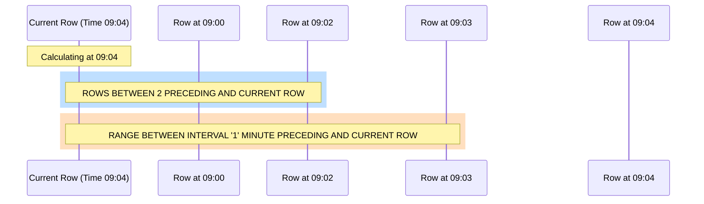
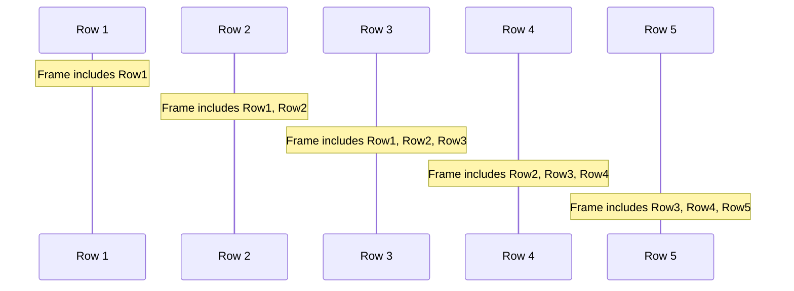
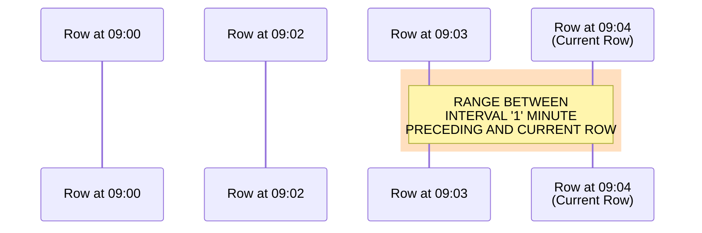

Window functions perform calculations across sets of table rows that are related to the current row. Unlike aggregate functions that return a single result for a group of rows, window functions return a value for every row while considering a window of rows defined by the OVER clause.

We'll cover high-level, introductory information about window functions then move into composition.
For some, it may be helpful to start with executing [common examples](#common-examples)
into our live demo. Experimenting with these examples, then referring back to the
reference, will help put everything in context.

## Deep Dive: What is a Window Function?

A window function performs a calculation across a set of rows that are related
to the current row. This set of related rows is called a "window", defined by an
`OVER` clause that follows the window function.

In practical terms, window functions are used when you need to perform a
calculation that depends on a group of rows, but you want to retain the
individual rows in the result set. This is different from aggregate functions
like a cumulative `sum` or `avg`, which perform calculations on a group of rows
and return a single result.

The underlying mechanism of a window function involves three components:

- **Partitioning:** The `PARTITION BY` clause divides the result set into
  partitions (groups of rows) upon which the window function is applied. If no
  partition is defined, the function treats all rows of the query result set as
  a single partition.

- **Ordering:** The `ORDER BY` clause within the `OVER` clause determines the
  order of the rows in each partition.

- **Frame Specification:** This defines the set of rows included in the window,
  relative to the current row. For example,
  `ROWS BETWEEN UNBOUNDED PRECEDING AND CURRENT ROW` includes all rows from the
  start of the partition to the current row.

Use cases for window functions are vast.

They are often used in analytics for tasks such as:

- Calculating running totals or averages
- Finding the maximum or minimum value in a sequence or partition
- Ranking items within a specific category or partition
- Calculating [moving averages](/docs/reference/function/window/#avg) or
  [cumulative sums](/docs/reference/function/window/#cumulative-sum)

Window functions are tough to grok.

An analogy before we get to building:

Imagine a group of cars in a race. Each car has a number, a name, and a finish
time. If you wanted to know the average finish time, you could use an aggregate
function like `avg` to calculate it. But this would only give you a single
result: the average time. You wouldn't know anything about individual cars'
times.

Now, let's say you want to know how each car's time compares to the average.
Enter window functions. A window function allows you to calculate the average
finish time (the window), but for each car (row) individually.

For example, you could use a window function to calculate the average finish
time for all cars, but then apply this average to each car to see if they were
faster or slower than the average. The `OVER` clause in a window function is
like saying, "for each car, compare their time to the average time of all cars."

So, in essence, window functions allow you to perform calculations that consider
more than just the individual row or the entire table, but a 'window' of related
rows. This 'window' could be all rows with the same value in a certain column,
like all cars of the same engine size, or it could be a range of rows based on
some order, like the three cars who finished before and after a certain car.

This makes window functions incredibly powerful for complex calculations and
analyses.

## Syntax

```txt
functionName OVER (
    [PARTITION BY columnName [, ...]]
    [ORDER BY columnName [ASC | DESC] [, ...]]
    [ROWS | RANGE BETWEEN frame_start AND frame_end]
    [EXCLUDE CURRENT ROW | EXCLUDE NO OTHERS]
)
```
Where:

- `functionName`: The window function to apply (e.g., avg, sum, rank)
- `OVER`: Specifies the window over which the function operates
  - `PARTITION BY`: Divides the result set into partitions
  - `ORDER BY`: Specifies the order of rows within each partition
  - `ROWS | RANGE BETWEEN`: Defines the window frame relative to the current row
  - `EXCLUDE`: Optionally excludes certain rows from the frame

## Supported functions

### Aggregate window functions

- [`avg()`](#avg) – Calculates the average within a window
- [`sum()`](#cumulative-sum) – Calculates the sum within a window
- [`count()`](#count) – Counts rows or non-null values
- [`first_value()`](#first_value) – Retrieves the first value in a window

### Window-only functions

- [`rank()`](#rank) – Assigns a rank to rows
- [`row_number()`](#row_number) – Assigns sequential numbers to rows

:::note
Window-only functions:
- Require an ORDER BY clause
- Cannot be used outside of window contexts (e.g., in WHERE clauses)
- Do not support frame clauses
:::

## Components of a window function

A window function calculates results across a set of rows related to the current row, called a window. This allows for complex calculations like moving averages, running totals, and rankings without collapsing rows.

1. **Function Name**: Specifies the calculation to perform (e.g., `avg(price)`)
2. **OVER Clause**: Defines the window for the function
   - `PARTITION BY`: Divides the result set into partitions
   - `ORDER BY`: Orders rows within partitions
   - Frame Specification: Defines the subset of rows using ROWS or RANGE
3. **Exclusion Option**: Excludes specific rows from the frame

### Example

```questdb-sql
SELECT
    symbol,
    price,
    timestamp,
    avg(price) OVER (
        PARTITION BY symbol
        ORDER BY timestamp
        ROWS BETWEEN 3 PRECEDING AND CURRENT ROW
    ) AS moving_avg
FROM trades;
```

This calculates a moving average of price over the current and three preceding rows for each symbol.

## Frame types and behavior

Window frames specify which rows are included in the calculation relative to the current row.



### ROWS frame

Defines the frame based on a physical number of rows:

```txt
ROWS BETWEEN 4 PRECEDING AND CURRENT ROW
```

This includes the current row and four preceding rows.



### RANGE frame

Defines the frame based on logical intervals of values in the ORDER BY column:



This diagram shows that when calculating at 09:04, the RANGE frame includes all rows with timestamps from 09:03 to 09:04.

When using RANGE frames with time-based intervals, you can specify the following time units:

- `day(s)`
- `hour(s)`
- `minute(s)`
- `second(s)`
- `millisecond(s)`
- `microsecond(s)`

```questdb-sql
SELECT
    timestamp,
    symbol,
    price,
    AVG(price) OVER (
        ORDER BY timestamp
        RANGE BETWEEN INTERVAL '1' HOUR PRECEDING AND CURRENT ROW
    ) AS hourly_avg
FROM trades;
```

This query calculates a moving average of price over the past hour for each row, using the RANGE frame with an interval of one hour.

:::note
RANGE frames require ORDER BY on a numeric or timestamp column.
:::

## Frame boundaries

Frame boundaries determine which rows are included in the window calculation:

- `UNBOUNDED PRECEDING`: Starts at the first row of the partition
- `<value> PRECEDING`: Starts or ends at a specified number of rows or interval before the current row
- `CURRENT ROW`: Starts or ends at the current row

When the frame clause is not specified, the default frame is
`RANGE UNBOUNDED PRECEDING`, which includes all rows from the start of the
partition to the current row.

- If `ORDER BY` is not present, the frame includes the entire partition, as all
  rows are considered equal.

- If `ORDER BY` is present, the frame includes all rows from the start of the
  partition to the current row. Note that `UNBOUNDED FOLLOWING` is only allowed
  when the frame start is `UNBOUNDED PRECEDING`, which means the frame includes
  the entire partition.

### Restrictions

1. Frame start can only be:
   - `UNBOUNDED PRECEDING`
   - `<value> PRECEDING`
   - `CURRENT ROW`

2. Frame end can only be:
   - `CURRENT ROW`
   - `<value> PRECEDING` (unless start is `UNBOUNDED PRECEDING`)

3. RANGE frames must have ORDER BY on a timestamp or numeric column

## Exclusion options

Modifies the window frame by excluding certain rows:

### EXCLUDE NO OTHERS
- Default behavior
- Includes all rows in the frame

### EXCLUDE CURRENT ROW
- Excludes the current row from the frame
- When frame ends at `CURRENT ROW`, end boundary automatically adjusts to `1 PRECEDING`

## Function reference

### avg()

In the context of window functions, `avg(value)` calculates the average of
`value` over the set of rows defined by the window frame.

**Arguments:**

- `value`: The column of numeric values to calculate the average of.

**Return value:**

- The average of `value` for the rows in the window frame.

**Description**

When used as a window function, `avg()` operates on a "window" of rows defined
by the `OVER` clause. The rows in this window are determined by the
`PARTITION BY`, `ORDER BY`, and frame specification components of the `OVER`
clause.

The `avg()` function respects the frame clause, meaning it only includes rows
within the specified frame in the calculation. The result is a separate average
for each row, based on the corresponding window of rows.

Note that the order of rows in the result set is not guaranteed to be the same
with each execution of the query. To ensure a consistent order, use an
`ORDER BY` clause outside of the `OVER` clause.

**Syntax:**
```questdb-sql title="avg() syntax" 
avg(value) OVER (window_definition)
```

**Example:**
```questdb-sql title="avg() example" demo
SELECT
    symbol,
    price,
    timestamp,
    avg(price) OVER (
        PARTITION BY symbol
        ORDER BY timestamp
        ROWS BETWEEN 3 PRECEDING AND CURRENT ROW
    ) AS moving_avg
FROM trades;
```

### Cumulative sum()

In the context of window functions, `sum(value)` calculates the sum of `value`
in the set of rows defined by the window frame. Also known as "cumulative sum".

**Arguments:**

- `value`: Any numeric value.

**Return value:**

- The sum of `value` for the rows in the window frame.

**Description**

When used as a window function, `sum()` operates on a "window" of rows defined
by the `OVER` clause. The rows in this window are determined by the
`PARTITION BY`, `ORDER BY`, and frame specification components of the `OVER`
clause.

The `sum()` function respects the frame clause, meaning it only includes rows
within the specified frame in the calculation. The result is a separate value
for each row, based on the corresponding window of rows.

Note that the order of rows in the result set is not guaranteed to be the same
with each execution of the query. To ensure a consistent order, use an
`ORDER BY` clause outside of the `OVER` clause.

**Syntax:**
```questdb-sql title="sum() syntax" 
sum(value) OVER (window_definition)
```

**Example:**
```questdb-sql title="sum() example" demo
SELECT
    symbol,
    amount,
    timestamp,
    sum(amount) OVER (
        PARTITION BY symbol
        ORDER BY timestamp
        ROWS BETWEEN UNBOUNDED PRECEDING AND CURRENT ROW
    ) AS cumulative_amount
FROM trades;
```

### count()

Counts rows or non-null values over the window frame.

**Syntax:**
```questdb-sql title="count() syntax" 
count(*) OVER (window_definition)
count(value) OVER (window_definition)
```

**Arguments:**
- `*`: Counts all rows
- `value`: Counts non-null values

**Example:**
```questdb-sql title="count() example" demo
SELECT
    symbol,
    count(*) OVER (
        PARTITION BY symbol
        ORDER BY timestamp
        RANGE BETWEEN INTERVAL '1' SECOND PRECEDING AND CURRENT ROW
    ) AS trades_last_second
FROM trades;
```

### first_value()

In the context of window functions, `first_value(value)` calculates the first
`value` in the set of rows defined by the window frame.

**Arguments:**

- `value`: Any numeric value.

**Return value:**

- The first occurrence of `value` (including null) for the rows in the window
  frame.

**Description**

`first_value()` operates on a "window" of rows defined by the `OVER` clause. The
rows in this window are determined by the `PARTITION BY`, `ORDER BY`, and frame
specification components of the `OVER` clause.

The `first_value()` function respects the frame clause, meaning it only includes
rows within the specified frame in the calculation. The result is a separate
value for each row, based on the corresponding window of rows.

Note that the order of rows in the result set is not guaranteed to be the same
with each execution of the query. To ensure a consistent order, use an
`ORDER BY` clause outside of the `OVER` clause.

**Syntax:**
```questdb-sql title="first_value() syntax" 
first_value(value) OVER (window_definition)
```

**Example:**
```questdb-sql title="first_value() example" demo
SELECT
    symbol,
    price,
    timestamp,
    first_value(price) OVER (
        PARTITION BY symbol
        ORDER BY timestamp
    ) AS first_price
FROM trades;
```

### rank()

In the context of window functions, `rank()` assigns a unique rank to each row
within the window frame, with the same rank assigned to rows with the same
values. Rows with equal values receive the same rank, and a gap appears in the
sequence for the next distinct value; that is, the `row_number` of the first row
in its peer group.

**Arguments:**

- `rank()` does not require arguments.

**Return value:**

- The rank of each row within the window frame. Return value type is `long`.

**Description**

When used as a window function, `rank()` operates on a "window" of rows defined
by the `OVER` clause. The rows in this window are determined by the
`PARTITION BY` and `ORDER BY` components of the `OVER` clause.

The `rank()` function assigns a unique rank to each row within its window, with
the same rank assigned to rows with the same values in the `ORDER BY` clause of
the `OVER` clause. It ignores the frame clause, meaning it considers all rows in
each partition, regardless of the frame specification.

Note that the order of rows in the result set is not guaranteed to be the same
with each execution of the query. To ensure a consistent order, use an
`ORDER BY` clause outside of the `OVER` clause.

**Syntax:**
```questdb-sql title="rank() syntax" 
rank() OVER (window_definition)
```

**Example:**
```questdb-sql title="rank() example" demo
SELECT
    symbol,
    price,
    timestamp,
    rank() OVER (
        PARTITION BY symbol
        ORDER BY price DESC
    ) AS price_rank
FROM trades;
```

### row_number()

In the context of window functions, `row_number()` assigns a unique row number
to each row within the window frame. For each partition, the row number starts
with one and increments by one.

**Arguments:**

- `row_number()` does not require arguments.

**Return value:**

- The row number of each row within the window frame. Return value type is
  `long`.

**Description**

When used as a window function, `row_number()` operates on a "window" of rows
defined by the `OVER` clause. The rows in this window are determined by the
`PARTITION BY` and `ORDER BY` components of the `OVER` clause.

The `row_number()` function assigns a unique row number to each row within its
window, starting at one for the first row in each partition and incrementing by
one for each subsequent row. It ignores the frame clause, meaning it considers
all rows in each partition, regardless of the frame specification.

Note that the order of rows in the result set is not guaranteed to be the same
with each execution of the query. To ensure a consistent order, use an
`ORDER BY` clause outside of the `OVER` clause.

**Syntax:**
```questdb-sql title="row_number() syntax" 
row_number() OVER (window_definition)
```

**Example:**
```questdb-sql title="row_number() example" demo
SELECT
    symbol,
    price,
    timestamp,
    row_number() OVER (
        PARTITION BY symbol
        ORDER BY timestamp
    ) AS trade_number
FROM trades;
```

## Common window function examples

### Moving average of best bid price

```questdb-sql title="Calculate 4-row moving average of best bid price" demo
SELECT
    timestamp,
    symbol,
    bid_px_00 as best_bid,
    avg(bid_px_00) OVER (
        PARTITION BY symbol
        ORDER BY timestamp
        ROWS BETWEEN 3 PRECEDING AND CURRENT ROW
    ) AS bid_moving_avg
FROM AAPL_orderbook
WHERE bid_px_00 > 0;
```

This example:
- Uses the best bid price (`bid_px_00`)
- Filters out zero/null bids
- Calculates average over 4 rows (current + 3 preceding)
- Groups by symbol (though in this case it's all AAPL)

### Cumulative bid size

```questdb-sql title="Calculate cumulative size for top 3 bid levels" demo
SELECT
    timestamp,
    bid_px_00,
    bid_sz_00,
    sum(bid_sz_00) OVER (
        ORDER BY timestamp 
        RANGE BETWEEN 60000000 PRECEDING AND CURRENT ROW
    ) as bid_volume_1min,
    bid_sz_00 + bid_sz_01 + bid_sz_02 as total_bid_size
FROM AAPL_orderbook
WHERE bid_px_00 > 0
LIMIT 10;
```

This example:
- Shows best bid price and size
- Calculates 1-minute rolling volume at best bid
- Sums size across top 3 price levels
- Filters out empty bids

### Order count analysis

```questdb-sql title="Compare order counts across price levels" demo
SELECT
    timestamp,
    bid_px_00,
    bid_ct_00 as best_bid_orders,
    sum(bid_ct_00) OVER (
        ORDER BY timestamp 
        ROWS BETWEEN 5 PRECEDING AND CURRENT ROW
    ) as rolling_order_count,
    bid_ct_00 + bid_ct_01 + bid_ct_02 as total_bid_orders
FROM AAPL_orderbook
WHERE bid_px_00 > 0
LIMIT 10;
```

This example:
- Shows best bid price and order count
- Calculates rolling sum of orders at best bid
- Sums orders across top 3 price levels
- Uses ROWS frame for precise control

### Moving sum of bid volume

```questdb-sql title="Calculate 1-minute rolling bid volume" demo
SELECT
    timestamp,
    bid_px_00,
    bid_sz_00,
    sum(bid_sz_00) OVER (
        ORDER BY timestamp 
        RANGE BETWEEN 60000000 PRECEDING AND CURRENT ROW
    ) as bid_volume_1min,
    bid_sz_00 + bid_sz_01 + bid_sz_02 as total_bid_size
FROM AAPL_orderbook
WHERE bid_px_00 > 0
LIMIT 10;
```

This example:
- Shows best bid price and size
- Calculates rolling 1-minute volume at best bid
- Also shows total size across top 3 levels
- Filters out empty bids

### Order frequency analysis

```questdb-sql title="Calculate order updates per minute" demo
SELECT
    timestamp,
    symbol,
    COUNT(*) OVER (
        ORDER BY timestamp 
        RANGE BETWEEN 60000000 PRECEDING AND CURRENT ROW
    ) as updates_per_min,
    COUNT(CASE WHEN action = 'A' THEN 1 END) OVER (
        ORDER BY timestamp 
        RANGE BETWEEN 60000000 PRECEDING AND CURRENT ROW
    ) as new_orders_per_min
FROM AAPL_orderbook
LIMIT 10;
```

This example:
- Counts all order book updates in last minute
- Specifically counts new orders (action = 'A')
- Uses rolling 1-minute window
- Shows order book activity patterns

## Notes and Restrictions

### ORDER BY Behavior
- ORDER BY in OVER clause determines the logical order for window functions
- Independent of the query-level ORDER BY
- Required for window-only functions
- Required for RANGE frames

### Frame Specifications
- ROWS frames:
  - Based on physical row counts
  - More efficient for large datasets
  - Can be used with any ORDER BY column

- RANGE frames:
  - Based on logical intervals
  - Require ORDER BY on timestamp or numeric column
  - Support time-based intervals (e.g., '1h', '5m')

### Exclusion Behavior
- Using `EXCLUDE CURRENT ROW` with frame end at `CURRENT ROW`:
  - Automatically adjusts end boundary to `1 PRECEDING`
  - Ensures consistent results across queries

### Window-Only Function Restrictions
- Always require ORDER BY clause
- Cannot be used in:
  - WHERE clauses
  - GROUP BY clauses
  - Window function arguments
- Do not support frame clauses

### Performance Considerations
- ROWS frames typically perform better than RANGE frames for large datasets
- Partitioning can improve performance by processing smaller chunks of data
- Consider index usage when ordering by timestamp columns

### Common pitfalls

#### Using window functions in WHERE clauses:

```questdb-sql title="Not allowed!"
-- Incorrect usage
SELECT
    symbol,
    price,
    timestamp
FROM trades
WHERE
    avg(price) OVER (ORDER BY timestamp) > 100;
```

#### Missing ORDER BY in OVER clause

```questdb-sql title="Missing ORDER BY"
-- Potential issue
SELECT
    symbol,
    price,
    sum(price) OVER () AS cumulative_sum
FROM trades;
```