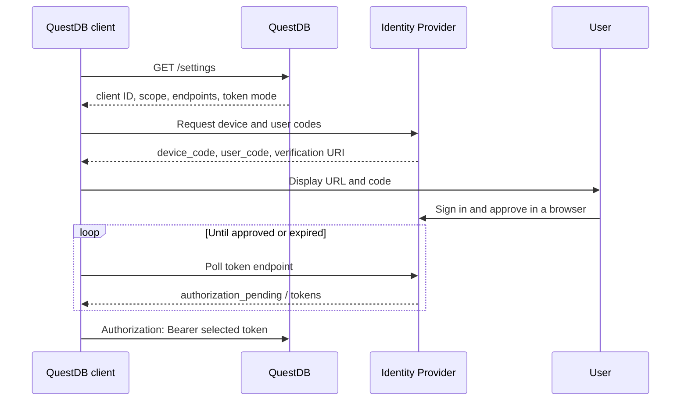

import Tabs from "@theme/Tabs";
import TabItem from "@theme/TabItem";
import JavaExample from "../partials/_oidc.device-flow.java.partial.mdx";
import PythonExample from "../partials/_oidc.device-flow.python.partial.mdx";
import RustExample from "../partials/_oidc.device-flow.rust.partial.mdx";
import CppExample from "../partials/_oidc.device-flow.cpp.partial.mdx";
import CExample from "../partials/_oidc.device-flow.c.partial.mdx";
import { EnterpriseNote } from "@site/src/components/EnterpriseNote"

<EnterpriseNote>
  The Device Authorization Flow signs in an interactive user from a client that
  cannot receive a browser redirect.
</EnterpriseNote>

The [OAuth 2.0 Device Authorization Grant](https://www.rfc-editor.org/rfc/rfc8628)
signs in a person without redirecting a browser back to the client. It is a good
fit for command-line applications, containers, and remote notebook kernels: the
client displays a verification URL and short code, and the user can authorize
from a browser on any laptop or phone.

QuestDB does not run the device flow. The client communicates directly with the
Identity Provider, then presents the resulting bearer token to QuestDB:



The client must respect the polling interval, `slow_down` responses, and the
device code's expiry. The official clients handle those protocol details,
choose the access or ID token according to
[`acl.oidc.groups.encoded.in.token`](/docs/security/oidc/#which-token-to-send), cache it in memory,
and refresh it silently when the provider issues a refresh token. They never
send the device code or the user's Identity Provider password to QuestDB.

## Configure the provider and QuestDB

Before using the flow:

1. Register the application as a public client with the Identity Provider and
   enable the device authorization grant on it. Each application which
   integrates via OIDC should have its own Client Id, so that it can be told
   apart from QuestDB in the provider's audit log and given its own policies.
   Pass that Client Id to the client explicitly, as described under
   [Explicit configuration and endpoint pinning](#explicit-configuration-and-endpoint-pinning).
2. Make the device authorization endpoint available to clients. For the
   zero-configuration examples below, `acl.oidc.configuration.url` must resolve
   a provider document containing `device_authorization_endpoint`, or the
   host-based configuration must set
   [`acl.oidc.device.authorization.endpoint`](/docs/configuration/oidc/#acloidcdeviceauthorizationendpoint).
3. Keep `openid` in `acl.oidc.scope`. Add `offline_access` if your provider
   requires that scope before issuing a refresh token to a device-flow client.

For example, a host-based configuration can add:

```ini title="server.conf"
acl.oidc.scope=openid offline_access
acl.oidc.device.authorization.endpoint=/as/device_authz.oauth2
```

The exact endpoint path and refresh-token scope are provider-specific. With
configuration-document discovery, do not set the endpoint property: all
individual endpoint settings are ignored in that mode.

If QuestDB does not publish the device authorization endpoint, pin the provider
with the client's `issuer` option so the client can fetch the provider's
`/.well-known/openid-configuration` document, or configure the client ID and
both endpoints explicitly.

## Official client examples

Each example discovers the OIDC client ID, scope, token-selection mode, and
provider endpoints from QuestDB's [settings endpoint](/docs/security/oidc/#settings-endpoint), then
signs in before opening the database connection.

Discovering the client ID means reusing QuestDB's own registration, which keeps
the examples short but gives the application no separate identity at the
provider. That is fine for evaluation; in production register the application
and set its Client Id explicitly, as described below.

The discovery URL must use `https`: reaching QuestDB over plaintext would let an
attacker replace the advertised Identity Provider endpoints and redirect the
device code and the refresh token, so the clients reject it rather than warn.
The Rust, C, C++ and Python clients accept loopback `http` for local
development; the Java client does not. To use a plaintext non-loopback host
anyway, opt in with `allowInsecureTransport(true)` (Java),
`.allow_insecure_transport(true)` (Rust),
`questdb_oidc_builder_allow_insecure_transport()` (C),
`allow_insecure_transport()` (C++) or `insecure=True` (Python).

<Tabs defaultValue="java" groupId="oidc-device-client">
<TabItem value="java" label="Java">

<JavaExample />

</TabItem>
<TabItem value="python" label="Python">

<PythonExample />

</TabItem>
<TabItem value="rust" label="Rust">

Enable the `oidc` crate feature:

```toml title="Cargo.toml"
[dependencies]
questdb-rs = { version = "7", features = ["oidc"] }
```

<RustExample />

</TabItem>
<TabItem value="cpp" label="C++">

<CppExample />

</TabItem>
<TabItem value="c" label="C">

<CExample />

</TabItem>
</Tabs>

The authentication object owns the token state. Pass it as a rotating provider,
as shown above, instead of copying the current token into the connection string;
otherwise a reconnect after token expiry will keep sending the stale value.

Device flow always requires a person to approve the sign-in. For unattended
services, scheduled jobs, or CI, use a service-account token or a provider flow
intended for machine identities instead.

### The sign-in prompt

Signing in renders the verification URL and the user code, then blocks until the
user approves or the device code expires. Where that text goes, and whether the
call runs at all without a terminal, differs by client:

| Client | Default prompt | Without a terminal |
| --- | --- | --- |
| Java | prints to `System.out`, then tries to open a browser | runs anyway; the client performs no terminal check |
| Python | prints to stderr, or to the frontend inside an IPython kernel | fails, unless the kernel accepts stdin |
| Rust, C, C++ | prints to stderr | fails with an interaction-required error |

Redirecting output therefore hides the code in Java, while a container with no
TTY fails outright in the other four. Override the default to render the
challenge elsewhere, or to declare the process interactive anyway:

| Client | Custom prompt | Force interactive |
| --- | --- | --- |
| Java | `prompt(...)`, or `DeviceCodePrompt.SYSTEM_OUT` to skip the browser launch | not applicable |
| Python | `renderer=` | `interactive=True` |
| Rust | `.renderer(...)` | `.interactive(true)` |
| C | `questdb_oidc_builder_event_handler()` | `questdb_oidc_builder_interactive()` |
| C++ | `.event_handler(...)` | `.interactive(true)` |

The prompt's text fields are display-safe. Where a client opens the URL or makes
it clickable, use the separately vetted browser target instead: `browser_target`
on the C event struct, `event_view::browser_target()` in C++.

### Explicit configuration and endpoint pinning

Discovery supplies the client ID, scope, audience, token-selection mode, and
endpoints. Set any of them explicitly when the application has its own
registration with the provider, or when QuestDB does not publish what the client
needs:

| Setting | Set it when |
| --- | --- |
| `client_id` | the application has its own registration, which is the recommended setup |
| `scope` | the provider requires `offline_access` before it issues a refresh token |
| `audience` | the provider requires one, or QuestDB validates `aud` against a non-default [`acl.oidc.audience`](/docs/configuration/oidc/#acloidcaudience). QuestDB does not publish that key, so discovery cannot supply it |
| `issuer` | QuestDB publishes no device authorization endpoint, so the client reads the provider's `/.well-known/openid-configuration` instead |
| `token_endpoint`, `device_authorization_endpoint` | pinning both endpoints directly rather than through an issuer |
| `groups_in_token` | overriding which of the two tokens the client selects |

Java exposes `issuer`, `prompt`, `tokenStore`, `tlsConfig` and
`allowInsecureTransport` on `OidcDeviceAuth.DiscoveryOptions`, and the full set
on `OidcDeviceAuth.builder()`, in camel case. Python passes them as keyword
arguments to `from_questdb`. Rust and C++ are builder methods in snake case, and
C prefixes the same names with `questdb_oidc_builder_`.

### Token persistence

Tokens stay in memory unless a file token store is enabled. The store writes the
access, ID and long-lived refresh tokens as unencrypted JSON, so turn it on only
where that at-rest exposure is acceptable:

| Client | Default location | A directory you choose |
| --- | --- | --- |
| Java | `FileTokenStore.atDefaultLocation()` | `FileTokenStore.at(path)` |
| Python | `FileTokenStore.at_default_location()` | `FileTokenStore.at(path)` |
| Rust | `FileTokenStore::at_default_location()?` | `FileTokenStore::at(path)` |
| C | `questdb_oidc_builder_default_file_token_store()` | `questdb_oidc_builder_file_token_store()` |
| C++ | `.default_file_token_store()` | `.file_token_store(directory)` |

Java, Python and Rust attach the store with `tokenStore(...)`, `token_store=`
and `.token_store(...)` respectively; the C and C++ calls above are builder
methods and attach it themselves.

The default directory is `$HOME/.questdb/oidc-tokens/`, overridden by the
`questdb.client.oidc.token.store.dir` environment variable. Java reads that same
name as a JVM system property rather than an environment variable, and falls
back to `${user.home}/.questdb/oidc-tokens/`. On Unix the clients create token
files with mode `0600` and the store directory with `0700`; on other platforms
the directory's existing ACL governs access, so restrict it before enabling the
store.

### Interaction-required errors

A transport call never prompts. When the cached token cannot be refreshed
silently, the call fails instead, and the application has to sign in again on
the main or UI thread:

| Client | How it surfaces |
| --- | --- |
| Python | `OidcInteractionRequired`, importable from `questdb.auth` |
| Rust | a `questdb::Error` carrying `ErrorCode::AuthError`; read `err.oidc_error()` and match on `OidcErrorKind::InteractionRequired` |
| C | error kind `QUESTDB_OIDC_ERROR_INTERACTION_REQUIRED` |
| C++ | `questdb::error_kind::interaction_required` |
| Java | `OidcAuthException`, with no distinct interaction-required type to match on |

In C++ a failure raised through an attached sender arrives as
`questdb::ingress::line_sender_error` carrying `oidc_diagnostic()`, not as
`questdb::oidc::error`, so catch the common base `const questdb::error&` to
handle both.
