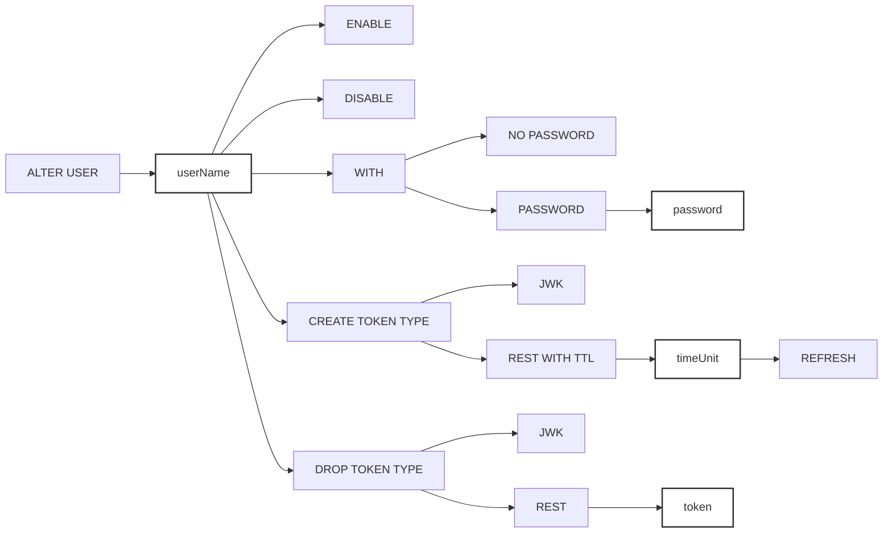

For full documentation of the Access Control List and Role-based Access Control,
see the [RBAC operations](/docs/operations/rbac) page.

:::note

Role-based Access Control (RBAC) operations are only available in QuestDB
Enterprise.

:::

---

`ALTER USER` modifies user settings.

## Syntax



## Description

- `ALTER USER username ENABLE` - enables user account.
- `ALTER USER username DISABLE` - disables user account.
- `ALTER USER username WITH PASSWORD password` - sets password for the user
  account.
- `ALTER USER username WITH NO PASSWORD` - removes password for the user
  account.
- `ALTER USER username CREATE TOKEN TYPE JWK` - adds Json Web Key to user
  account. Returns public key (x, y) and private key. The private key is not
  stored in QuestDB.
- `ALTER USER username DROP TOKEN TYPE JWK` - removes Json Web Key from user
  account.
- `ALTER USER username CREATE TOKEN TYPE REST WITH TTL timeUnit REFRESH` - adds
  REST token to user account.
- `ALTER USER username DROP TOKEN TYPE REST token` - removes REST token from
  user account.

## Examples

### Enable user

```questdb-sql
ALTER USER john ENABLE;
```

### Disable user

```questdb-sql
ALTER USER john DISABLE;
```

### Set password

```questdb-sql
ALTER USER john WITH PASSWORD '1m@re@lh@cker';
```

### Remove password

```questdb-sql
ALTER USER john WITH NO PASSWORD;
```

Removing user's password is not possible with `WITH PASSWORD ''` because it
rejects empty passwords.

### Add Json Web Key

```questdb-sql
ALTER USER john CREATE TOKEN TYPE JWK;
```

### Remove Json Web Key

```questdb-sql
ALTER USER john DROP TOKEN TYPE JWK;
```

Result of commands above can be verified with `SHOW USER`, e.g.

```questdb-sql
SHOW USER john;
```

| auth_type  | enabled |
| ---------- | ------- |
| Password   | true    |
| JWK Token  | false   |
| REST Token | false   |

### Add REST API token

```questdb-sql
-- generate a token with no TTL refresh
ALTER USER john CREATE TOKEN TYPE REST WITH TTL '1m';
-- generate a token with TTL refresh
ALTER USER john CREATE TOKEN TYPE REST WITH TTL '1m' REFRESH;
```

Here, the TTL (Time-to-Live) value should contain an integer and a unit, e.g.
`1m`. The supported units are:

- `s` - second
- `m` - minute
- `h` - hour
- `d` - day

The minimal allowed TTL value is 1 minute, the maximum value is 10 years (10 \*
365 days).

The REFRESH modifier is optional. When the REFRESH modifier is specified, the
token's expiration timestamp will be refreshed on each successful
authentication.

:::note

When replication is used, the token will not be refreshed on successful
authentication on replicas, but only on the primary node. This makes tokens with
the REFRESH modifier meaningful for use on the primary node only.

:::

### Remove REST API token

```questdb-sql
-- drop single REST API token
ALTER USER john DROP TOKEN TYPE REST 'qt1cNK6s2t79f76GmTBN9k7XTWm5wwOtF7C0UBxiHGPn44';
-- drop all REST API tokens for the given user
ALTER USER john DROP TOKEN TYPE REST;
```

Result of commands above can be verified with `SHOW USER`, e.g.

```questdb-sql
SHOW USER john;
```

| auth_type  | enabled |
| ---------- | ------- |
| Password   | true    |
| JWK Token  | false   |
| REST Token | false   |
